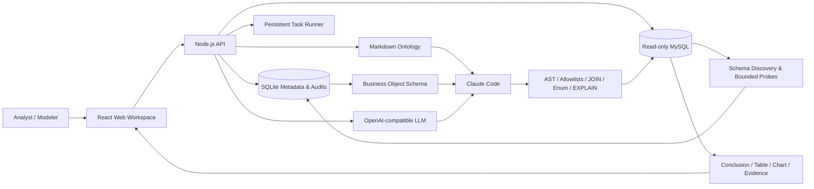

# OntoQuery · Ontology-Driven Conversational Analytics

English | [简体中文](./README.md)

> Connect database metadata, business ontology, governed Text-to-SQL, and evaluation audits into one working pipeline—so natural-language analytics is explainable, verifiable, and controllable.


OntoQuery is an ontology-driven conversational analytics platform for enterprise data. It discovers metadata and bounded value evidence from read-only MySQL sources, builds human-reviewed business objects, properties, and links, and produces traceable answers by calling Claude Code for question understanding, SQL planning, and answers, with platform-owned execution guards and result-equivalence evaluations.

New workspaces start empty. Connect read-only MySQL and build the ontology; production startup never loads demo data or canned answers.

## Why OntoQuery

- **Business semantics first** — Object Types, Properties, and Link Types provide Claude with business definitions and physical mappings.
- **Human-approved relationships** — structural candidates, model review, and bounded value checks only produce suggestions; confirmed relationships inform Claude without defining database permissions.
- **Governed SQL end to end** — every query passes single-`SELECT` AST validation, `EXPLAIN` cost checks, timeouts, and row limits.
- **Evidence-rich answers** — conclusions, tables, charts, and evidence remain traceable to SQL, rules, knowledge pages, and execution audits.
- **Quality gates** — compare Claude results with reviewed Gold SQL, repair ontology definitions, and rerun before publishing.
- **Least privilege by default** — physical read-only checks, AES-256-GCM credential encryption, scoped roles, rate limits, and read-only execution guards.

## Capabilities

| Area | What it provides |
| --- | --- |
| Source discovery | `information_schema`, table grading, bounded probes, persistent background tasks, and restart recovery |
| Relationship discovery | structural candidates, LLM metadata review, local value-overlap checks, and human confirm/reject workflow |
| Ontology knowledge | `tables / terms / metrics / joins / rules` Markdown pages, SQLite CRUD, term-first retrieval, and Wikilink expansion |
| Business modeling | visual Object / Property / Link editing, physical mappings, immutable versions, diffs, revalidation, publish, and rollback |
| Conversational analytics | semantic Query Plans, controlled SQL compilation, clarification, tables/charts/CSV, and supporting evidence |
| Evaluation governance | isolated Gold SQL, real result-set equivalence, repair suggestions, and semantic/Agent comparison gates |
| Access control | `viewer / analyst / editor / admin`, bearer tokens, data-source scopes, and rate limits |
| Operations | Docker Compose baseline, hardened containers, health checks, backup and recovery guidance |

## Architecture

See [the current query architecture and migration notes](docs/QUERY_ARCHITECTURE.md).



The browser handles workflow and presentation only. Credential management, database access, discovery, ontology construction, semantic compilation, SQL validation, and execution stay in the local API.

## Quick start

### Requirements

- Node.js `22.13+`; Node.js 24 is recommended
- npm, bundled with Node.js
- Optional: Docker and Docker Compose
- Optional: a read-only MySQL account and an OpenAI-compatible model endpoint

### Run locally

```bash
git clone <your-repository-url>
cd ontology-query-platform
cp .env.example .env.local
npm ci
npm run dev
```

Open:

- Web workspace: <http://localhost:3000>
- API health: <http://localhost:8787/api/health>
- API readiness: <http://localhost:8787/api/ready>

`npm run dev` starts both the web app and the local API. On first launch, the API creates its SQLite database under `.data/` and starts an empty workspace.

Development can use the local admin token from `.env.local`. Do not set `NEXT_PUBLIC_API_WRITE_TOKEN` in production; the sign-in token is kept only in the current tab's `sessionStorage`.

## Connect real data

1. Add MySQL in the Data Sources view with a read-only account, or call `POST /api/sources`.
2. Run the connection test. OntoQuery checks `SELECT`, `@@read_only`, and verifies that temporary table creation is denied.
3. Start discovery. A background task reads metadata, runs bounded probes, creates relationship candidates, and performs batched model review.
4. Confirm or reject candidates in the disambiguation queue. Model suggestions remain in `review` and never grant JOIN access by themselves.
5. Model Objects, Properties, Links, and physical mappings in the ontology workspace; validate and publish the Schema.
6. Build an evaluation set and validate Claude against Gold SQL before publishing ontology changes.

Relationship review sends only table and column names, types, indexes, and comments to the model. Database passwords and raw sampled values never enter prompts. Column profiling is disabled by default; when enabled, it is restricted to A/B-grade tables and redacted.

## Models and query modes

Configure an OpenAI-compatible Chat Completions endpoint for live model calls:

```dotenv
LLM_BASE_URL=https://your-compatible-endpoint/v1
LLM_API_KEY=replace-with-your-model-api-key
LLM_MODEL=your-model-name
```

Ontology construction uses the LLM configuration above. Queries require `CLAUDE_QUERY_BINARY`, an exact `CLAUDE_QUERY_MODEL`, and `ANTHROPIC_API_KEY`. Run `npm run claude:preflight` before querying.

Claude Code is the sole query engine. The frontend retains `/api/query`, SSE progress, clarification, sessions, charts, tables, and exports. Request-local MCP tools provide ontology reads and guarded SQL execution; answers must reference execution IDs issued by the current request.

Configure `QUERY_MAX_SQL_CALLS`, `QUERY_MAX_SCANNED_ROWS`, and `QUERY_PENDING_TTL_MS`. Legacy planner modes and rollout flags are retired; migrate old Agent budget settings to these names. A zero Claude request budget disables queries. Historical engine-comparison gates must be rerun against Claude and Gold SQL.

See [`.env.example`](./.env.example) for all environment variables and safety defaults.

## Commands

```bash
npm run dev            # Start web and API
npm run dev:web        # Start web only
npm run dev:api        # Start API only, in watch mode
npm run lint           # ESLint
npm run build          # Production build
npm test               # Server tests
npm run test:rendered  # Rendered-page tests
npm run check          # lint + build + all tests
```

## Docker Compose

```bash
cp deploy/env.production.example .env.production
# Edit .env.production and replace every token, APP_SECRET, and model key
docker compose up -d --build
```

Containers drop Linux capabilities, enable `no-new-privileges`, use a read-only root filesystem, and persist SQLite and Markdown ontology data in named volumes. Put a TLS reverse proxy in front of any public deployment and enforce request-size limits and redacted access logs.

See [Deployment and Operations](./docs/DEPLOYMENT.md) for production configuration, backups, recovery, and the launch checklist.

## Security boundaries

- Source passwords are encrypted with AES-256-GCM using key material derived from `APP_SECRET`.
- MySQL connections disable multi-statements; connection tests require temporary table creation to fail.
- SQL must be a single read-only `SELECT` and pass table, column, JOIN, enum, and cost allowlists.
- Sensitive fields are blocked before sampling, retrieval, output, filtering, or aggregation.
- Bearer tokens bind both a role and allowed data sources; reads, writes, and queries have separate limits.
- Held-out Gold SQL is never returned by read APIs and is available only to the server-side evaluator.
- Production secrets and tokens must live in a dedicated secrets manager.

## Repository layout

```text
app/                 React web workspace
server/src/          API, MySQL discovery, ontology, SQL guards, and evaluation
server/test/         Server tests
tests/               Rendered-page tests
docs/                Architecture, API, deployment, and implementation docs
scripts/             Development and evaluation scripts
examples/            Example evaluation manifests
.ontology-wiki/      Runtime Markdown ontology (Git-ignored)
.data/               SQLite and local runtime state (Git-ignored)
```

## Documentation

- [Architecture](./docs/ARCHITECTURE.md)
- [HTTP API](./docs/API.md)
- [Deployment and operations](./docs/DEPLOYMENT.md)
- [Implementation status](./docs/IMPLEMENTATION_STATUS.md)
- [AI ontology modeling plan](./docs/AI_ONTOLOGY_MODELING_PLAN.md)
- [Query Loop V2 implementation plan](./docs/QUERY_LOOP_V2_IMPLEMENTATION_PLAN.md)

Most detailed design documents are currently written in Simplified Chinese.

## Current scope

This repository is a runnable, single-instance baseline. Enterprise acceptance still requires integration with real MySQL and LLM services, accountable metric owners, a sufficiently large Gold SQL suite, enterprise SSO/secrets management, and production load testing. Row-level authorization and distributed task queues remain future extensions.

## License

This project is licensed under the [Apache License 2.0](./LICENSE). You may use, modify, and distribute it, including for commercial purposes, subject to the attribution, change-notice, and other conditions in the license.
