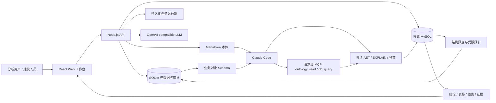

# OntoQuery · 本体驱动智能问数平台

[English](./README.en.md) | 简体中文

> 将数据库结构、业务本体、受控 Text-to-SQL 与评测审计连接成一条可运行链路，让自然语言问数不仅“能回答”，而且可解释、可验证、可治理。


OntoQuery 是一个面向企业数据分析场景的本体驱动智能问数平台。它从只读 MySQL 自动探查结构和受限值域，构建可人工审核的业务对象、属性与关系模型，问数时调用 Claude Code 完成理解、SQL 规划与回答；平台保留只读执行、会话、前端展示和结果等价评测。

首次启动为空工作区，请先接入只读 MySQL 并构建本体。测试目录使用显式夹具，生产服务不加载演示数据或静态答案。

## 为什么使用 OntoQuery

- **业务语义先行**：以 Object Type、Property、Link Type 描述业务对象，向 Claude 提供业务知识与物理映射。
- **关系必须确认**：结构候选、模型审阅和值域验证只生成建议，确认结果作为 Claude 的关系参考，不作为数据库查询权限。
- **SQL 全链路受控**：执行前经过单条 `SELECT` AST、`EXPLAIN` 成本、超时和行数上限检查。
- **证据完整可追溯**：回答同时提供结论、表格、图表和依据，并保留 SQL、规则、知识页及执行审计。
- **结果驱动改进**：对照 Gold SQL 验证 Claude 回答，失败时修正本体和知识，再运行门禁。
- **默认最小权限**：MySQL 只读验证、AES-256-GCM 凭据加密、角色与数据源范围控制、限流与只读执行护栏。

## 功能概览

| 模块 | 能力 |
| --- | --- |
| 数据源探查 | `information_schema`、表分级、受限探针、持久化异步任务与重启恢复 |
| 关系发现 | 结构候选、LLM 元数据审阅、本地值域重叠验证、人工确认/否决闭环 |
| 本体知识 | `tables / terms / metrics / joins / rules` Markdown 页面、SQLite CRUD、术语检索与 Wikilink 扩展 |
| 业务对象建模 | Object / Property / Link 可视化编辑、物理映射、版本、Diff、重新校验、发布与回滚 |
| 智能问数 | Claude Code 规划与回答，交互式澄清、表格/图表/CSV 与证据展示 |
| 评测治理 | Gold SQL 隔离、真实结果集等价判定、失败修复建议、Claude 与 Gold SQL 门禁 |
| 访问控制 | `viewer / analyst / editor / admin`、Bearer token、数据源范围、请求限流 |
| 部署运维 | Docker Compose、安全容器基线、健康检查、备份恢复指引 |

## 架构

当前职责、升级参数和验证方式见 [问数架构](docs/QUERY_ARCHITECTURE.md)。



浏览器只负责工作流与展示；凭据管理、数据库连接、探查、知识构建、语义编译、SQL 校验和执行均在本地 API 中完成。

## 快速开始

### 环境要求

- Node.js `22.13+`，建议使用 Node.js 24
- npm（随 Node.js 安装）
- 可选：Docker 与 Docker Compose
- 可选：只读 MySQL 账号、OpenAI-compatible 模型服务

### 本地运行

```bash
git clone <your-repository-url>
cd ontology-query-platform
cp .env.example .env.local
npm ci
npm run dev
```

启动后访问：

- Web 工作台：<http://localhost:3000>
- API 健康检查：<http://localhost:8787/api/health>
- API 就绪检查：<http://localhost:8787/api/ready>

`npm run dev` 会同时启动 Web 和本地 API。首次启动时，API 会在 `.data/` 创建 SQLite 数据库，初始工作区不含数据源。

开发环境可使用 `.env.local` 中的本地管理员 token。生产环境不要设置 `NEXT_PUBLIC_API_WRITE_TOKEN`；登录页输入的 token 只保存在当前标签页的 `sessionStorage`。

## 接入真实数据

1. 使用只读账号在“数据源”页添加 MySQL，或调用 `POST /api/sources`。
2. 点击“连接测试”。系统会验证 `SELECT`、`@@read_only`，并尝试创建临时表以确认账号不可写。
3. 点击“开始探查”。后台任务读取结构、运行受限探针、生成关系候选并进行模型批量审阅。
4. 在“消歧队列”确认或否决候选关系。模型建议需要核验后进入本体知识。
5. 在业务对象建模工作台维护 Object、Property、Link 及物理映射，校验后发布 Schema。
6. 建立评测集并运行门禁，验证 Claude 回答后启用本体版本。

关系审阅只向模型发送表名、字段名、类型、索引和注释；数据库密码和原始采样值不会进入提示词。列值画像默认关闭，启用后也只覆盖 A/B 级表并进行脱敏。

## 模型与查询模式

配置 OpenAI-compatible Chat Completions 服务后启用真实模型调用：

```dotenv
LLM_BASE_URL=https://your-compatible-endpoint/v1
LLM_API_KEY=replace-with-your-model-api-key
LLM_MODEL=your-model-name
```

上述模型配置用于本体构建。问数另行配置 `CLAUDE_QUERY_BINARY`、`CLAUDE_QUERY_MODEL`、`ANTHROPIC_API_KEY`，然后运行 `npm run claude:preflight`。Claude 是唯一问数引擎；缺少配置或执行失败会明确返回失败原因。

浏览器仍使用 `/api/query`，保留 SSE、工具进度、澄清续答、会话、图表与导出。平台通过请求级 MCP 提供本体读取和只读 SQL 执行；Claude 必须引用本次实际执行生成的 execution ID，不能提交自造结果。

使用 `QUERY_MAX_SQL_CALLS`、`QUERY_MAX_SCANNED_ROWS`、`QUERY_PENDING_TTL_MS` 配置执行预算和澄清期限。旧 `QUERY_AGENT_*`、`SEMANTIC_QUERY_PLAN_MODE`、`CLAUDE_QUERY_MODE` 与灰度参数已退役；升级时需将原预算迁移到新名称。`CLAUDE_QUERY_MAX_BUDGET_USD=0` 可暂停问数。

评测每个用例调用一次 Claude，对照经过同一执行护栏的 Gold SQL。候选版本、评测集校验和、完整结果和实际 Claude 执行证据用于发布检查；旧引擎门禁需要重新运行。

完整环境变量及安全默认值见 [`.env.example`](./.env.example)。

## 常用命令

```bash
npm run dev            # 同时启动 Web 与 API
npm run dev:web        # 仅启动 Web
npm run dev:api        # 仅启动 API（watch 模式）
npm run lint           # ESLint
npm run typecheck      # TypeScript 类型检查
npm run build          # 生产构建
npm test               # 服务端测试
npm run test:rendered  # 页面渲染测试
npm run check          # 类型检查 + lint + build + 全部测试
```

## Docker Compose 部署

```bash
cp deploy/env.production.example .env.production
# 编辑 .env.production，替换全部 token、APP_SECRET 和模型密钥
docker compose up -d --build
```

容器默认丢弃 Linux capabilities、启用 `no-new-privileges` 和只读根文件系统，并将 SQLite 与 Markdown 本体存储在持久卷中。对外服务时请在前面配置 TLS 反向代理，并限制请求体及脱敏访问日志。

生产配置、备份恢复和上线验收清单见 [部署文档](./docs/DEPLOYMENT.md)。

## 安全边界

- 数据源密码使用 `APP_SECRET` 派生密钥进行 AES-256-GCM 加密。
- MySQL 连接禁用多语句；连接测试要求临时建表操作失败。
- SQL 必须是单条只读 `SELECT`，并通过表、字段、JOIN、枚举与成本白名单。
- 敏感字段在采样、检索、输出、过滤和聚合前被拦截。
- Bearer token 同时绑定角色和可访问数据源；读、写、查询分别限流。
- Held-out Gold SQL 不通过读取接口返回，仅供服务端评测执行器使用。
- 生产环境必须使用独立秘密管理系统保存 `APP_SECRET`、token 和模型密钥。

## 项目结构

```text
app/                 React Web 工作台
server/src/          API、MySQL 探查、知识、本体、SQL 护栏与评测
server/test/         服务端测试
tests/               页面渲染测试
docs/                架构、API、部署与实施文档
scripts/             开发启动与评测脚本
examples/            示例评测清单
.ontology-wiki/      运行时 Markdown 本体（Git 忽略）
.data/               SQLite 与本地运行状态（Git 忽略）
```

## 文档

- [架构说明](./docs/ARCHITECTURE.md)
- [HTTP API](./docs/API.md)
- [部署与运维](./docs/DEPLOYMENT.md)
- [实现状态](./docs/IMPLEMENTATION_STATUS.md)
- [AI 本体建模方案](./docs/AI_ONTOLOGY_MODELING_PLAN.md)
- [Query Loop V2 实施方案](./docs/QUERY_LOOP_V2_IMPLEMENTATION_PLAN.md)

## 当前边界

仓库提供的是可本地运行的单实例基线。正式企业验收仍需要真实 MySQL/LLM 联调、业务口径负责人、足量 Gold SQL、企业 SSO/密钥管理和生产负载测试。行级权限、分布式任务队列等能力属于后续扩展。

## 许可证

本项目采用 [Apache License 2.0](./LICENSE)。你可以使用、修改和分发本项目，包括商业用途；重新分发时需遵守许可证中的署名、修改声明和其他条件。
