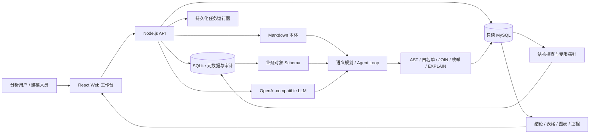

# OntoQuery · 本体驱动智能问数平台

[English](./README.en.md) | 简体中文

> 将数据库结构、业务本体、受控 Text-to-SQL 与评测审计连接成一条可运行链路，让自然语言问数不仅“能回答”，而且可解释、可验证、可治理。


OntoQuery 是一个面向企业数据分析场景的本体驱动智能问数平台。它从只读 MySQL 自动探查结构和受限值域，构建可人工审核的业务对象、属性与关系模型，再通过语义查询计划、SQL 安全护栏和结果等价评测生成可追溯的问数结果。

项目内置“客户 → 订单 → 支付 → 退款”演示域，无需连接真实数据库即可体验完整工作流。真实数据源不会使用静态答案或伪造指标作为回退。

## 为什么使用 OntoQuery

- **业务语义先行**：以 Object Type、Property、Link Type 描述业务对象，而非把数据库字段直接暴露给规划模型。
- **关系必须确认**：结构候选、模型审阅和值域验证只生成建议，只有人工确认的 JOIN 才能进入执行白名单。
- **SQL 全链路受控**：执行前经过单条 `SELECT` AST、表/字段、JOIN、枚举、`EXPLAIN` 成本、超时和行数上限检查。
- **证据完整可追溯**：回答同时提供结论、表格、图表和依据，并保留 SQL、规则、知识页及执行审计。
- **可量化灰度启用**：通过 Gold SQL 结果等价、失败率、延迟、token 与工具成功率门禁，评估语义规划和 Agent Loop。
- **默认最小权限**：MySQL 只读验证、AES-256-GCM 凭据加密、角色与数据源范围控制、限流及敏感字段前置拦截。

## 功能概览

| 模块 | 能力 |
| --- | --- |
| 数据源探查 | `information_schema`、表分级、受限探针、持久化异步任务与重启恢复 |
| 关系发现 | 结构候选、LLM 元数据审阅、本地值域重叠验证、人工确认/否决闭环 |
| 本体知识 | `tables / terms / metrics / joins / rules` Markdown 页面、SQLite CRUD、术语检索与 Wikilink 扩展 |
| 业务对象建模 | Object / Property / Link 可视化编辑、物理映射、版本、Diff、重新校验、发布与回滚 |
| 智能问数 | 语义 Query Plan、受控 SQL 编译、交互式澄清、表格/图表/CSV 与证据展示 |
| Agent Loop | 有预算的工具循环、会话稳定分桶、失败安全回退与全程审计 |
| 评测治理 | Gold SQL 隔离、真实结果集等价判定、失败修复建议、语义与 Agent 对照门禁 |
| 访问控制 | `viewer / analyst / editor / admin`、Bearer token、数据源范围、请求限流 |
| 部署运维 | Docker Compose、安全容器基线、健康检查、备份恢复指引 |

## 架构



浏览器只负责工作流与展示；凭据管理、数据库连接、探查、知识构建、语义编译、SQL 校验和执行均在本地 API 中完成。

## 快速开始

### 环境要求

- Node.js `22.13+`，建议使用 Node.js 24
- npm（随 Node.js 安装）
- 可选：Docker 与 Docker Compose
- 可选：只读 MySQL 账号、OpenAI-compatible 模型服务

### 本地运行

```bash
git clone <your-repository-url>
cd ontology-query-platform
cp .env.example .env.local
npm ci
npm run dev
```

启动后访问：

- Web 工作台：<http://localhost:3000>
- API 健康检查：<http://localhost:8787/api/health>
- API 就绪检查：<http://localhost:8787/api/ready>

`npm run dev` 会同时启动 Web 和本地 API。首次启动时，API 会在 `.data/` 创建 SQLite 数据库并自动装载演示工作区。

开发环境可使用 `.env.local` 中的本地管理员 token。生产环境不要设置 `NEXT_PUBLIC_API_WRITE_TOKEN`；登录页输入的 token 只保存在当前标签页的 `sessionStorage`。

## 接入真实数据

1. 使用只读账号在“数据源”页添加 MySQL，或调用 `POST /api/sources`。
2. 点击“连接测试”。系统会验证 `SELECT`、`@@read_only`，并尝试创建临时表以确认账号不可写。
3. 点击“开始探查”。后台任务读取结构、运行受限探针、生成关系候选并进行模型批量审阅。
4. 在“消歧队列”确认或否决候选关系。模型建议默认处于 `review`，不会自动获得 JOIN 权限。
5. 在业务对象建模工作台维护 Object、Property、Link 及物理映射，校验后发布 Schema。
6. 建立评测集并运行门禁，再按需灰度启用语义规划或 Agent Loop。

关系审阅只向模型发送表名、字段名、类型、索引和注释；数据库密码和原始采样值不会进入提示词。列值画像默认关闭，启用后也只覆盖 A/B 级表并进行脱敏。

## 模型与查询模式

配置 OpenAI-compatible Chat Completions 服务后启用真实模型调用：

```dotenv
LLM_BASE_URL=https://your-compatible-endpoint/v1
LLM_API_KEY=replace-with-your-model-api-key
LLM_MODEL=your-model-name
```

未配置模型时，演示工作区使用确定性规划器；真实数据源会明确拒答，不会伪造结果。

### 语义 Query Plan

通过 `SEMANTIC_QUERY_PLAN_MODE` 控制：

- `off`：使用兼容查询链路，默认值。
- `prefer`：优先使用已发布且兼容的 Ontology Schema，失败时在安全条件下回退。
- `required`：必须使用语义计划，不允许回退。

### Agent Loop

通过 `QUERY_AGENT_MODE` 控制：

- `off`：保持单发链路，默认值。
- `prefer`：需要探索或首次护栏/执行失败时升级为工具循环。
- `required`：仅允许 Agent Loop。

Agent 只能调用受限工具，不能直接访问数据库。迭代数、SQL 次数、累计扫描行数、澄清有效期和灰度比例均可配置。建议在评测中心门禁通过后，再将 `prefer` 流量按 `10% → 30% → 100%` 放量。

完整环境变量及安全默认值见 [`.env.example`](./.env.example)。

## 常用命令

```bash
npm run dev            # 同时启动 Web 与 API
npm run dev:web        # 仅启动 Web
npm run dev:api        # 仅启动 API（watch 模式）
npm run lint           # ESLint
npm run build          # 生产构建
npm test               # 服务端测试
npm run test:rendered  # 页面渲染测试
npm run check          # lint + build + 全部测试
```

## Docker Compose 部署

```bash
cp deploy/env.production.example .env.production
# 编辑 .env.production，替换全部 token、APP_SECRET 和模型密钥
docker compose up -d --build
```

容器默认丢弃 Linux capabilities、启用 `no-new-privileges` 和只读根文件系统，并将 SQLite 与 Markdown 本体存储在持久卷中。对外服务时请在前面配置 TLS 反向代理，并限制请求体及脱敏访问日志。

生产配置、备份恢复和上线验收清单见 [部署文档](./docs/DEPLOYMENT.md)。

## 安全边界

- 数据源密码使用 `APP_SECRET` 派生密钥进行 AES-256-GCM 加密。
- MySQL 连接禁用多语句；连接测试要求临时建表操作失败。
- SQL 必须是单条只读 `SELECT`，并通过表、字段、JOIN、枚举与成本白名单。
- 敏感字段在采样、检索、输出、过滤和聚合前被拦截。
- Bearer token 同时绑定角色和可访问数据源；读、写、查询分别限流。
- Held-out Gold SQL 不通过读取接口返回，仅供服务端评测执行器使用。
- 生产环境必须使用独立秘密管理系统保存 `APP_SECRET`、token 和模型密钥。

## 项目结构

```text
app/                 React Web 工作台
server/src/          API、MySQL 探查、知识、本体、SQL 护栏与评测
server/test/         服务端测试
tests/               页面渲染测试
docs/                架构、API、部署与实施文档
scripts/             开发启动与评测脚本
examples/            示例评测清单
.ontology-wiki/      运行时 Markdown 本体（Git 忽略）
.data/               SQLite 与本地运行状态（Git 忽略）
```

## 文档

- [架构说明](./docs/ARCHITECTURE.md)
- [HTTP API](./docs/API.md)
- [部署与运维](./docs/DEPLOYMENT.md)
- [实现状态](./docs/IMPLEMENTATION_STATUS.md)
- [AI 本体建模方案](./docs/AI_ONTOLOGY_MODELING_PLAN.md)
- [Query Loop V2 实施方案](./docs/QUERY_LOOP_V2_IMPLEMENTATION_PLAN.md)

## 当前边界

仓库提供的是可本地运行的单实例基线。正式企业验收仍需要真实 MySQL/LLM 联调、业务口径负责人、足量 Gold SQL、企业 SSO/密钥管理和生产负载测试。行级权限、分布式任务队列等能力属于后续扩展。

## 许可证

本仓库当前未声明开源许可证。未经版权所有者明确许可，不应将代码视为可自由复制、修改或分发的开源软件。
