# AI 辅助本体自动建模实施方案

> 版本：v0.2  
> 日期：2026-08-14  
> 状态：M0–M3 已实现并通过全量回归；M4 工程门禁与真实 `review` Object 试点已完成，等待目录刷新后的重新生成、双人复核、Link、Gold SQL 与发布后业务证据  
> v0.2 修订：评分权重冷启动校正与语义一致性确定性算法；stableKey 契约固化；Link 两段触发；新增 `namespace / relationKind / freshness` 契约扩展；候选合并操作；超宽表截断规则；审计留痕、门禁样本量与补录指标细化。  
> 目标：复用现有数据探查、业务 Schema 校验、不可变版本和评测门禁，增加“模型生成候选 → 确定性评分 → 自动/人工确认 → 组装草稿”的建模流水线，把重复建模工作从手工录入转为候选审核。

## 1. 背景与现状

平台已经具备两类基础能力：

- 物理资产探查：表、字段、类型、注释、敏感标记、枚举、主键、索引和关系候选；
- 业务对象建模：Object Type、Property、Link Type、物理映射、Schema 校验、不可变草稿、发布、回滚和评测门禁。

当前缺口是两者之间没有自动转换。真实数据源完成探查后，工程师仍需从空白表单手工创建 Object Type 和 Link Type。以 `rock_readonly` 这类数百张表的数据源为例，直接人工梳理成本高，而一次性把整库元数据交给模型也会产生上下文膨胀、重复对象、错误映射和不可审计的问题。

本方案增加有界、可审核、可回滚的 AI 建模流水线。模型只生成候选，确定性代码负责证据校验、评分、状态路由和草稿组装。

## 2. 首期范围

### 2.1 纳入首期

1. 从用户选择的物理表生成 Object Type 候选；
2. 基于已生成对象和已确认物理 JOIN 生成 Link Type 候选；
3. 为每个候选保存物理证据、模型说明、评分明细和校验结果；
4. 候选总分 `>= 80` 且无例外条件时自动确认；
5. 候选总分 `< 80` 时进入人工确认队列；
6. 确认后的候选组装为新的不可变 Schema 草稿；
7. 继续复用现有 Schema 校验、Diff、评测门禁和人工发布流程；
8. 记录生成批次、模型版本、Prompt 版本、token、耗时和全部状态变更。

### 2.2 后续阶段

- 整库业务域聚类与分域批量生成；
- 从指标、Gold SQL、ETL 和只读 View 提取无副作用 Function 候选；
- 公共业务本体模板与数据源映射配置分离，实现跨工厂复用。

### 2.3 明确不做

- 不自动发布 Schema；自动确认仅表示进入待组装草稿；
- 不让模型修改当前发布版本；每次应用候选都创建新草稿；
- 不把数据库记录值发送给模型，首期只使用非敏感元数据；
- 不一次性向模型发送整库全部表和字段；
- 不自动确认 Function；Function 首期不生成；
- 不实现 Action。平台继续保持 `ROCK_READONLY`，不扩展写入、审批或副作用权限；
- 不绕过现有物理映射、已确认 JOIN、敏感字段和发布评测门禁。

## 3. 设计原则

1. **候选而非事实**：LLM 只提出 Object/Link 候选，不直接写入发布 Schema；
2. **确定性评分**：候选总分由服务端根据目录证据计算，模型自报置信度只展示，不直接决定自动确认；
3. **80 分阈值无空档**：`score >= 80` 自动确认，`score < 80` 人工确认，正好 80 分归入自动确认；
4. **硬规则优先于分数**：校验错误、敏感映射、未确认 JOIN 等条件可以覆盖分数；
5. **发布边界不变**：自动确认、组装草稿、发布是三个独立状态，只有人工发布可以影响查询运行时；
6. **证据可追溯**：每个对象、属性和关系都能回到真实表、字段、关系 ID、知识页或模板；
7. **上下文有界**：按选中表或业务域分批生成，限制单批表数、字段数和输出候选数；
8. **数据源隔离**：候选、批次、草稿和证据全部绑定 `source_id`，禁止跨源引用物理映射；
9. **失败不影响现网**：生成失败、审核未完成或草稿无效时，当前发布版本和问数链路保持不变。

## 4. 总体架构

```mermaid
flowchart LR
  CATALOG["物理目录：表 / 字段 / 已确认 JOIN"] --> SCOPE["范围构建：选中表 / 业务域"]
  KNOWLEDGE["知识页 / 历史查询 / 行业模板"] --> SCOPE
  SCOPE --> OBJECT_AGENT["LLM 生成 Object 候选"]
  OBJECT_AGENT --> NORMALIZE["允许列表归一化与证据绑定"]
  NORMALIZE --> OBJECT_SCORE["确定性评分与 Schema 校验"]
  OBJECT_SCORE --> OBJECT_ROUTE{"Object 评分和例外规则"}
  OBJECT_ROUTE -->|">=80 且可自动确认"| OBJECT_ACCEPTED["已确认 Object"]
  OBJECT_ROUTE -->|"<80 或强制人工"| OBJECT_REVIEW["Object 人工确认队列"]
  OBJECT_REVIEW -->|"确认"| OBJECT_ACCEPTED
  OBJECT_ROUTE -->|"确定性错误"| BLOCKED["阻止"]
  OBJECT_ACCEPTED --> LINK_AGENT["LLM 生成 Link 候选"]
  LINK_AGENT --> LINK_SCORE["JOIN 证据、端点、基数校验与评分"]
  LINK_SCORE --> LINK_ROUTE{"Link 评分和例外规则"}
  LINK_ROUTE -->|">=80 且可自动确认"| LINK_ACCEPTED["已确认 Link"]
  LINK_ROUTE -->|"<80 或强制人工"| LINK_REVIEW["Link 人工确认队列"]
  LINK_REVIEW -->|"确认"| LINK_ACCEPTED
  LINK_ROUTE -->|"确定性错误"| BLOCKED
  OBJECT_ACCEPTED --> ASSEMBLE["组装新 Schema 草稿"]
  LINK_ACCEPTED --> ASSEMBLE
  ASSEMBLE --> VALIDATE["现有 validateSemanticSchema"]
  VALIDATE --> DRAFT["不可变 draft 版本"]
  DRAFT --> GATE["Diff / Gold SQL 评测门禁"]
  GATE --> PUBLISH["人工发布"]
```



## 5. 候选模型与状态机

### 5.1 生成批次

每次 AI 建模创建一个 Generation Run，固定以下快照：

- 数据源 ID；
- 生成方式：`selected_tables`，后续扩展 `business_domain`；
- 表范围及目录校验和；
- 基础 Schema 版本，可为空；
- 模型名、Prompt 版本和评分规则版本；
- 发起人、任务状态、进度、token、耗时和错误；
- 候选数量、自动确认数量、人工队列数量、阻止数量。

目录或基础发布版本发生变化后，不允许直接应用旧批次；必须重新校验或重新生成。批次读取 API 实时返回 `catalogCurrent`，工作台把过期批次标为只读并提供基于原范围重新生成入口，避免直到提交审核或应用时才暴露漂移冲突。

### 5.2 候选类型

首期支持：

- `object`：一个完整 Object Type，包含属性、主键和物理字段映射；
- `link`：两个已确认 Object Type 之间的 Link Type，包含基数和物理关系 ID。

每个候选包含：

```json
{
  "id": "candidate-id",
  "runId": "generation-run-id",
  "sourceId": 2,
  "candidateType": "object",
  "stableKey": "object:trial_account",
  "payload": {},
  "evidence": [],
  "modelConfidence": 0.86,
  "score": 84,
  "scoreBreakdown": {},
  "status": "auto_confirmed",
  "forcedReviewReasons": [],
  "validation": {"ok": true, "errors": [], "warnings": []}
}
```

`stableKey` 生成规则（M0 契约固化，去重、替代与跨批次合并全部依赖它）：

- `object` 候选：`object:{namespace}:{主表物理名}`。首期 Object 限定单表映射，主表物理名天然稳定；`namespace` 取本批次业务域名称的 slug，未填写时为 `default`；
- `link` 候选：`link:{namespace}:{源 stableKey}:{relationId}:{目标 stableKey}`，方向按物理关系方向归一，反向重复候选归并到同一键；
- 稳定键只由物理与批次输入决定，不依赖模型起的 apiName；人工修订显示名称不改变稳定键；
- 跨批次替代：`UNIQUE(run_id, candidate_type, stable_key)` 只保证批次内唯一；应用草稿时若其他批次存在同键已确认候选，较早候选转 `superseded` 并通过 `superseded_by_id` 与事件记录指向替代者；
- 人工合并：被合并候选转 `superseded`，证据并入保留候选并记录合并事件。

### 5.3 候选状态

```text
generated
  ├─ blocked              确定性错误，不能确认
  ├─ auto_confirmed       >=80 且没有强制人工条件
  └─ review_required      <80 或命中强制人工条件
       ├─ confirmed       人工确认，可带人工修订
       └─ rejected        人工拒绝

auto_confirmed / confirmed
  ├─ superseded           重新生成、人工合并或跨批次同键替代
  └─ applied              已组装到一个不可变草稿
```

自动确认候选在应用草稿前仍允许人工撤回。人工修改候选后必须重新运行确定性校验，并将最终状态记为 `confirmed`，不能继续标记为模型自动确认。

### 5.4 契约扩展字段

- Object Type 可选 `namespace`：业务域命名空间，进入 stableKey；为 M5「公共业务模板 + 数据源 Mapping Profile」复用预留，避免后期改契约；
- Object / Property 可选 `freshness`（`realtime / hourly / daily / batch`）：由服务端从分区信息、时间戳列和数据源类型确定性推导，模型不自报；供问数链路提示数据新鲜度；
- Link Type 可选 `relationKind`（`contains 包含 / references 引用 / temporal 时序`）：模型提出语义分类，服务端按证据校验（如 `temporal` 要求端点存在时间字段），用于 join 路径选择与语义评分；
- 三个字段全部可选、向后兼容，现有已发布 Schema 不需要迁移。

## 6. 评分与自动确认策略

### 6.1 统一评分结构

候选总分为 0–100 的整数，第一版使用以下可解释权重：

| 证据项 | 权重 | Object 的解释 | Link 的解释 |
|---|---:|---|---|
| 物理映射完整性与可用性 | 35 | 表、字段存在且为 A/B 级有效资产，类型兼容 | 两端对象映射有效，物理路径存在 |
| 名称、类型和注释语义一致性 | 25 | 对象/属性命名与表字段注释一致 | 关系名称、relationKind 与端点、字段注释一致 |
| 主键或 JOIN 结构证据 | 25 | 主键为已知主键/唯一字段 | 引用显式外键或人工确认 JOIN，基数一致 |
| 知识、查询或业务证据 | 10 | 术语、指标、已审核问题或查询日志支持对象定义 | 知识页、查询路径或业务描述支持关系语义 |
| 已有模板匹配 | 5 | 与已审核行业/企业对象模板一致 | 与已审核关系模板一致 |

权重设计的冷启动约束：物理映射 + 语义一致性 + 结构证据合计 85 分。新数据源首次建模时通常没有知识页积累和已审核模板，后两项接近 0 分；权重保证一个物理与结构证据完备、语义一致的候选在冷启动阶段仍可越过 80 分自动确认线，知识与模板证据作为加分项而非门槛。随知识资产积累，可通过评分规则版本升级重新分配权重。

语义一致性的确定性算法（占 25 分，不允许运行时调用 LLM 评判）：

- 使用现有 embedding 客户端计算候选名称/描述与表字段注释的向量相似度，解决中文注释与英文字段名的跨语言对齐；
- embedding 模型名和版本纳入 `scoring_version`，相似度分档阈值固定，保证同一评分版本下结果可复现；
- 注释缺失的字段该项按中档保底计分，不因物理侧文档缺失惩罚候选；
- embedding 服务不可用时该项计 0 分并在评分明细标注降级原因，候选自然落入人工队列，不阻塞批次。

说明：

- 模型负责提出语义解释和证据引用，服务端负责验证证据是否真实存在并计算分数；
- `modelConfidence` 单独展示，首期不进入总分，避免模型自报高置信度造成自动确认；
- 缺少知识页或模板不会直接阻止候选，但会失去相应分数；
- 评分规则带版本号，历史候选保留生成时的分数和评分明细。

### 6.2 路由规则

```text
if 存在确定性校验错误:
    blocked
else if 命中强制人工条件:
    review_required
else if score >= 80:
    auto_confirmed
else:
    review_required
```

### 6.3 强制人工条件

以下候选即使超过 80 分，也不能自动确认：

1. 包含敏感字段映射；
2. Link 引用的关系不是显式外键或人工确认状态；
3. 引用其他数据源的表、字段或关系；
4. 修改、删除当前发布 Schema 中的对象、主键、属性类型、物理映射或 Link；
5. 模型证据与目录证据存在冲突；
6. 后续阶段的所有 Function 和 Action；
7. 管理员配置的其他强制审核规则。

### 6.4 阻止条件

- 引用不存在、失效或 C 级表；
- 引用不存在字段或类型不兼容字段；
- Object 主键缺失，或主键不是必填属性；
- Object 映射到多张表；首期 Object 限定单表映射，多表对象推迟到 M5 与模板机制一并设计；
- Link 端点不存在或物理 JOIN 无法连接两端对象；
- 候选所属数据源与生成批次不一致；
- 生成后物理目录校验和已变化且重新校验失败。

## 7. 生成流水线

### 7.1 范围选择

首期只支持“从选中表生成”：

- 默认只展示有效 A/B 级表；
- 一次最多选择 20 张表；
- 单批最多发送 600 个非敏感字段，超过后按确认关系图拆批；
- 范围页通过服务端同源预览接口计算实际配置下的表/字段预算、关系连通分量和预计批次，不使用前端字段总数简单除法估算；
- 单张表字段数超过批内上限时按优先级截断：主键与唯一键 → 已确认 JOIN 涉及字段 → 有注释字段 → 索引字段 → 其余字段；被截断字段数记入批次摘要并在候选证据中标注“字段不完整”，此类候选强制人工确认；
- 已确认关系只有在两个端点字段都存在且均为非敏感字段时才能参与范围构图和 Object Prompt；敏感端点、失效端点和因字段预算跨批而未进入 Object Prompt 的关系分别计数，Prompt 构造时再做一次独立校验；
- 用户可以填写业务域名称和一句业务描述，用作语义提示；业务域名称同时作为候选 `namespace`；
- 已发布或指定基础 Schema 作为去重和增量生成依据。

整库生成留到第二阶段：先按已确认 JOIN、命名、注释和查询共现聚类为业务域，再逐域执行同一流水线。

### 7.2 Object 候选生成

首期每个 Object 候选限定映射到单张主表（见 6.4 阻止条件）。

Prompt 实现为“固定模板 + 版本化变量槽”结构，模板本体带 `prompt_version`，三类变量槽独立注入：目录语料（表字段元数据）、业务语料（业务域名称与描述）、知识语料（术语与指标摘要）。换数据源或业务域只替换语料，模板不变；模板变更才升级 `prompt_version`。该结构同时是 M5 跨工厂模板复用的基础。

模型输入：

- 表名、表注释、表等级；
- 非敏感字段名、类型、注释、主键/唯一/索引标记；
- 选中表之间已确认的物理关系；
- 已验证术语和指标摘要；
- 基础 Schema 的业务定义，不暴露不相关物理映射；
- 严格的 Object Type 输出契约与数量上限。

模型输出经过本地归一化：

1. API 名称规范化；
2. 表字段允许列表校验；
3. SQL 类型到语义类型映射；
4. 重复对象和属性检测；
5. 候选证据绑定；`freshness` 由服务端从目录证据推导，不采纳模型自报值；
6. 对单个候选构造临时 Schema 并调用现有 `validateSemanticSchema`；
7. 服务端评分并路由状态。

### 7.3 Link 候选生成

只有已确认或自动确认的 Object 候选才能作为 Link 端点。模型只能从服务端提供的已确认物理关系集合中选择 `relationId`，不能自由生成 JOIN。

Link 生成分两段触发，解决“端点尚未人工确认时 Link 无从生成”的时序问题：

- **首段（run 内自动）**：Object 阶段结束后，仅以 `auto_confirmed` 的 Object 候选为端点生成 Link 候选，随批次进度展示；
- **补段（人工触发）**：人工队列中的 Object 候选被确认后，批次详情页出现“补充生成 Link”入口，以全部已确认端点增量生成尚未覆盖的 Link 候选，复用同一批次的目录快照并重新核对校验和；已生成的 Link 候选按 stableKey 去重，不重复出现；
- 冷启动阶段自动确认率可能偏低，补段是 Link 覆盖的主路径，产品交互按此设计。

Link 候选依次执行：

1. 端点存在性和数据源一致性校验；
2. 物理 JOIN 状态与连接路径校验；
3. 基数方向校验；`relationKind` 语义分类按证据校验；
4. 重复/反向关系检测；
5. 证据绑定、评分和状态路由。

### 7.4 草稿组装

用户点击“生成 Schema 草稿”时：

1. 锁定本批次全部 `auto_confirmed` 和人工 `confirmed` 候选；apply 请求可携带排除列表，被排除候选保持已确认状态，留待后续批次应用；
2. 再次核对目录校验和与基础版本；
3. 对稳定键去重，对人工修订优先；跨批次同键候选按 5.2 规则替代；
4. 与基础 Schema 合并；首期不允许 AI 自动覆盖已有定义；
5. 调用现有完整 Schema 校验；
6. 校验通过或带问题保存新的不可变 `draft`；
7. 候选记录草稿版本 ID 并转为 `applied`；
8. 后续发布仍走当前 Diff、影响分析、Gold SQL 门禁和人工发布。

## 8. 存储设计

新增三张表，全部采用增量迁移，不修改现有 Schema 版本表语义。

### 8.1 `ds_ontology_generation_run`

核心字段：

- `id / source_id / task_id`；
- `mode / scope_json / catalog_checksum / base_schema_version_id`；
- `model_name / prompt_version / scoring_version`；
- `status / progress / summary_json / token_usage_json / error`；
- `created_by / created_at / started_at / finished_at`。

### 8.2 `ds_ontology_candidate`

核心字段：

- `id / run_id / source_id / candidate_type / stable_key`；
- `payload_json / evidence_json / model_confidence`；
- `score / score_breakdown_json / validation_json`；
- `status / forced_review_reasons_json / decision_note`；
- `reviewed_by / reviewed_at / applied_schema_version_id / superseded_by_id`；
- `created_at / updated_at`。

约束与索引：

- `UNIQUE(run_id, candidate_type, stable_key)`；
- `(source_id, status, score DESC)` 支持审核队列；
- `(run_id, candidate_type)` 支持批次查看；
- 所有状态更新使用事务和期望旧状态，防止重复审核覆盖。

### 8.3 `ds_ontology_candidate_event`

记录自动路由、人工确认、拒绝、修改、合并、撤回、应用草稿等事件，保存操作者、前后状态、备注和时间。候选主体保存当前状态，事件表提供完整审计。

### 8.4 模型输入输出留痕

每次模型调用的完整 Prompt 与原始输出落盘到受限访问的运行目录（按 run 组织，editor 以上可见），审计表只存哈希与摘要用于索引。审核工作台按需读取调用摘要，只有 editor 打开并选择具体调用时才加载完整 Prompt 与原始输出。仅存哈希无法支撑坏候选的事后复盘；完整留痕才能回放“模型看到了什么、说了什么”。留痕内容遵守 11.1 的最小化约束——本身不含记录值与敏感字段，保留期限跟随批次记录。

## 9. API 契约草案

| 方法 | 路径 | 角色 | 用途 |
|---|---|---|---|
| POST | `/api/ontology/generation-scope` | editor | 按服务端当前预算预览批次、截断与关系过滤，不创建任务 |
| POST | `/api/ontology/generation-runs` | editor | 创建后台生成任务 |
| GET | `/api/ontology/generation-runs?sourceId=:id` | viewer | 列出生成批次 |
| GET | `/api/ontology/generation-runs/:id` | viewer | 查看批次进度、摘要与实时 `catalogCurrent` 状态 |
| GET | `/api/ontology/generation-runs/:id/traces` | editor | 列出受限访问的模型调用审计摘要 |
| GET | `/api/ontology/generation-runs/:id/traces/:file` | editor | 查看完整 Prompt 与原始输出留痕 |
| GET | `/api/ontology/candidates?sourceId=:id&runId=:run&status=:status` | viewer | 查询候选队列 |
| GET | `/api/ontology/candidates/:id` | viewer | 查看候选、证据和评分明细 |
| GET | `/api/ontology/candidates/:id/events` | viewer | 查看自动路由、审核、合并、校准与应用时间线 |
| POST | `/api/ontology/candidates/:id/decision` | editor | 确认、拒绝或撤回候选 |
| POST | `/api/ontology/candidates/:id/merge` | editor | 将候选合并到同批次另一候选 |
| POST | `/api/ontology/candidates/bulk-decision` | editor | 批量处理人工队列 |
| POST | `/api/ontology/generation-runs/:id/apply` | editor | 将确认候选组装为新草稿，可携带排除列表 |
| POST | `/api/ontology/generation-runs/:id/links` | editor | 端点人工确认后补充生成 Link 候选 |

创建任务示例：

```json
{
  "sourceId": 2,
  "mode": "selected_tables",
  "tableNames": ["alpha_account", "trial_record"],
  "domainName": "AlphaGPT 账号",
  "domainDescription": "账号、试用资格和到期时间",
  "baseSchemaVersionId": null
}
```

人工决策示例：

```json
{
  "decision": "confirm",
  "candidate": {},
  "note": "业务确认账号类型 3 表示产品账号"
}
```

生成任务复用现有 `BackgroundTask`，新增 `taskType: "ontology_generation"`。同一数据源同时只运行一个建模生成任务，但不阻塞正常查询和数据探查读取。

## 10. 前端方案

在“业务对象建模”工作台增加“AI 生成草稿”入口，分为四步：

### 10.1 选择范围

- 搜索并勾选表；
- 显示字段数量、敏感字段数量、已确认 JOIN 数量；
- 填写业务域名称和说明；
- 显示单批 20 表/600 字段限制以及预计批次数。

### 10.2 生成进度

- 展示“准备目录 → 识别对象 → 校验评分 → 识别关系（自动确认端点）→ 完成”；
- 展示候选数、自动确认数、人工审核数、阻止数、耗时和 token；
- 批次详情提供“补充生成 Link”入口，在人工确认新端点后可用；
- 任务失败后可以基于同一范围重新生成，不留下半成品草稿。
- 目录漂移批次显示“目录过期”，仅允许查看候选、事件与模型留痕；审核、Link、草稿操作关闭，并可基于原范围重生成。

### 10.3 候选队列

四个筛选页签：

- `自动确认`：如“自动确认 · 92 分”；
- `待人工确认`：如“待人工确认 · 76 分”；
- `强制人工`：如“88 分 · 涉及敏感字段”；
- `已阻止/已拒绝`：显示确定性错误或人工理由。

候选卡片展示：

- 对象/关系名称和业务描述；
- 属性、主键、端点、基数和 relationKind；
- 真实表字段或 relationId；
- 总分及五项评分明细；
- 与确定性总分分离展示的模型自报置信度；
- 证据来源和模型说明；
- Schema 校验错误与警告；
- 自动路由、人工决策、合并、校准和草稿应用的追加式事件时间线；
- 确认、编辑后确认、拒绝、合并到其他候选、撤回操作。

合并操作用于处理模型输出的重复候选（同一业务对象被拆成多个近似候选是高频情况）：选择保留候选后，被合并候选转 `superseded`，其证据并入保留候选并记录事件；逐个拒绝再手工改保留者不可接受。

### 10.4 草稿预览

- 展示将新增的 Object、Property 和 Link 数量；
- 与基础/发布 Schema 做 Diff；
- 有冲突时要求人工选择保留现有定义或采用修订候选；
- 点击应用后创建新草稿，并跳转到现有结构化编辑器继续校验和发布。

## 11. 安全、并发与回滚

1. **模型数据最小化**：首期不发送记录值、凭据、敏感字段和无关表；审计表只保存输入哈希和摘要，完整 Prompt 与输出按 8.4 落盘到受限访问存储供事后复盘；
2. **Prompt Injection 防护**：表和字段注释作为不可信数据区隔，不能改变系统指令；输出必须通过本地允许列表和 Schema 校验；
3. **无模型写库权限**：模型只能返回 JSON 候选，所有状态和草稿由服务端事务写入；
4. **目录快照防漂移**：运行、审核和应用阶段都核对目录校验和；物理结构变化时重新校验；
5. **基础版本防冲突**：生成期间发布版本变化时禁止直接应用，要求重新基线或人工合并；
6. **可撤回**：应用前可撤回自动确认；应用后通过废弃草稿或现有版本回滚处理，不删除历史记录；
7. **功能开关**：新增 `ONTOLOGY_AI_MODELING_MODE=off|review|auto_draft`，默认 `off`。`review` 只生成候选且全部人工确认，`auto_draft` 才启用 80 分自动确认策略；
8. **阈值配置**：新增 `ONTOLOGY_AI_AUTO_CONFIRM_SCORE`，默认 80，合法范围 0–100；生产启用前仍需通过候选精度门禁。
9. **校准证据防漂移与职责分离**：只有目录校验和仍然有效的批次可以写入或聚合校准标签；`review` 模式下候选须先完成首轮确认、拒绝或合并，再由不同身份完成独立双检。同一身份仅改变大小写或空白不能绕过职责分离，历史无效标签保留审计但不计入门禁。
10. **Gold 证据新鲜度与发布绑定**：草稿发布保护可以使用发布前语义对照门禁；`auto_draft` 校准必须在试点 Schema 发布后重新执行 `off` 对 `prefer` 的语义门禁。评测门禁固化 Schema 发布时刻和评测集校验和，评测集增删改、Schema 被替代、未实际进入语义 Query Plan 或误用 Agent 门禁都会使校准失败。

## 12. 分阶段实施

> 2026-08-14 实施进度：M0–M3 的候选生成、结构化单条编辑、批量审核、Link 补段、完整 Diff、显式冲突处理和草稿闭环已通过自动化回归；范围页已改为调用服务端同源预算预览，批次、超宽表截断、跨批关系和敏感/失效关系过滤均可在生成前核对，Object Prompt 对关系端点执行二次非敏感校验。M4 已补齐追加式独立双检标签、目录新鲜度门禁与过期批次只读/重生成 UX、首轮审核/双检身份分离、被拒绝或合并错误样本的分类标注、精度/召回/运行预算聚合、草稿发布率、语义执行率、JOIN 失败率、门禁快照、`auto_draft` 受控启用和前端校准看板；校准看板直接列出各评测集的 Gold/Held-out 完整度，可针对当前发布 Schema 触发并轮询发布后语义门禁。Gold 证据要求当前评测集校验和、当前发布 Schema、发布时刻快照与真实语义执行全部匹配，旧评测或发布前门禁不能启用 `auto_draft`。`rock_readonly` 已完成 15 表真实 `review` 模式 Object 候选生成，试点证据见 [ONTOLOGY_AI_ROCK_READONLY_PILOT.md](./ONTOLOGY_AI_ROCK_READONLY_PILOT.md)；目录刷新后的重新生成、双人复核、Link 补段、正式 Gold SQL 与发布后验证仍需真实业务证据，不能由代码替代。

### M0｜契约、迁移与评分器（2–3 个工程日）

- 新增 Run/Candidate/Event 数据表和 Store API；
- 固化候选 JSON 契约（含 `namespace / relationKind / freshness` 可选字段）、stableKey 生成规则、状态机、评分规则版本；
- 实现 79/80/81 分边界、强制人工和阻止规则；语义一致性项接入 embedding 相似度并纳入 `scoring_version`；
- 增加功能开关，默认关闭。

出口：不调用模型即可用固定候选完成评分、状态路由、审计和并发测试。

### M1｜Object 候选后台生成（3–4 个工程日）

- 服务端同源范围预览、按确认关系图分批、字段截断、敏感/失效端点关系过滤与目录校验和；
- Object Prompt、严格 JSON 归一化、物理证据绑定；
- 接入现有 LLM 客户端和 BackgroundTask；
- 单候选 Schema 校验、去重、评分和持久化。

出口：从 5–20 张选中表生成可追溯 Object 候选，模型编造表字段不能进入自动确认。

### M2｜Link 候选与草稿组装（3–4 个工程日）

- 以已确认 Object 候选为端点生成 Link，实现 run 内首段与人工确认后补段两条触发路径；
- 限制只能选择已确认 relationId；
- Link 评分、relationKind 证据校验、强制人工和阻止规则；
- 从确认候选组装、校验并保存不可变草稿，支持排除列表与跨批次同键替代。

出口：Object/Link 候选可以形成有效草稿，当前发布版本不受影响。

### M3｜候选审核工作台（4–6 个工程日）

- 范围选择、后台进度、候选分组和评分明细；
- 单条编辑/确认/拒绝/合并/撤回与批量决策；
- 补充生成 Link 入口；
- 草稿 Diff 预览和应用入口；
- viewer/editor 权限和数据源隔离。

出口：工程师无需编辑 JSON 即可完成“生成 → 审核 → 草稿”闭环。

### M4｜真实数据源校准与灰度（2–3 个工程日）

- 在 `rock_readonly` 选择一个 10–20 张核心表的业务域作为试点；
- 建立人工标注候选集，首轮审核与独立双检由两个不同身份完成，校准评分明细但保持 80 分产品阈值；
- 先以 `review` 模式运行，再根据精度门禁切换 `auto_draft`；
- 同时统计精度与召回：人工补录对象数、大幅修改率进入校准输入；
- 对生成草稿运行 Schema 校验、Diff 和正式 Gold SQL 评测；人工发布后在校准看板选择 Gold 已补齐的评测集，对当前发布版本再执行一次同集语义门禁，作为校准的发布后证据。

出口：自动确认候选精度达到门禁，且发布后的问数结果等价率不下降。

### M5｜分域、模板与 Function（后续）

- 整库业务域聚类与批次编排；
- 多表映射 Object：设计跨表连接路径校验后放开首期单表限制；
- 公共业务对象定义（namespace 维度）与数据源物理 Mapping Profile 分离；
- 跨工厂模板复用和映射差异审核；Prompt 模板的三类变量槽按数据源替换语料；
- 从已验证指标、Gold SQL、ETL 和只读 View 生成 Function 候选；
- Function 全部强制人工确认，不自动发布。

## 13. 测试与验收标准

### 13.1 自动化测试

1. 分数 79 → `review_required`，80/81 → `auto_confirmed`；
2. 90 分候选包含敏感字段 → `review_required`；
3. 90 分 Link 引用 review/rejected JOIN → `blocked`；
4. 不存在表、字段、跨源映射或多表 Object → `blocked`；
5. 模型自报置信度变化不影响确定性总分；
6. 同一证据和评分版本产生相同总分；embedding 服务不可用时语义项计 0 并标注降级；
7. 模型输出重复对象、非法名称、未知字段时正确归一化或阻止；
8. stableKey 不随模型 apiName 和人工修订显示名变化；跨批次同键候选正确触发 `superseded`；
9. 合并操作：被合并候选转 `superseded`、证据并入保留候选并记录事件；
10. 人工修改后重新校验并记录事件；
11. 重复审核请求不能覆盖已完成决策；
12. 目录变化或基础版本变化时禁止直接应用；补段生成 Link 前重新核对校验和；
13. 草稿组装不覆盖现有发布版本；排除列表候选保持已确认状态；
14. viewer 不能生成、审核或应用候选；
15. 不同数据源不能读取或处理对方候选；
16. `freshness` 由服务端推导，模型自报值不被采纳；
17. 模型超时、非法 JSON、任务恢复和重试路径可审计；
18. 现有问数、发布、回滚、Agent Loop 和评测测试全部回归通过。

### 13.2 真实数据源门禁

在切换到 `auto_draft` 前，至少对试点域完成一批人工双检：

- 校准批次的物理目录校验和必须仍然有效；默认聚合自动排除过期批次，显式选择过期批次时门禁失败；
- `review` 模式候选必须先完成首轮审核，再由不同身份写入校准标签；同人标签和未完成首审的标签不计入样本；
- 自动确认候选准确率 `>= 95%`，且自动确认样本数 `>= 40`；样本不足时扩大试点域或延长 `review` 模式积累，不以小样本通过门禁；
- 自动确认候选物理映射错误数为 0；
- 未确认 JOIN 自动确认数为 0；
- 敏感字段自动确认数为 0；
- 候选重复率和人工大幅修改率可接受；
- 人工补录对象占最终对象总数 `<= 20%`（召回门禁；超出说明模型漏识别严重，需先调整 Prompt 或范围构建）；
- 草稿 Schema 校验通过；
- 试点 Schema 已发布且仍是当前发布版本；
- 发布后 `off` 对 `prefer` 的 Gold SQL 语义门禁通过，结果等价率不低于当前基线、候选组确实进入语义 Query Plan，且门禁保存的评测集校验和仍与当前有效用例一致；
- 单批 token、延迟和失败率在配置预算内。

若精度门禁未通过，系统保持 `review`，不降低既定 80 分阈值来追求自动确认率；应调整证据权重、Prompt、业务模板或提高自动确认所需条件。

## 14. 运行指标

每个数据源和生成批次记录：

- 候选总数、Object/Link 数量；
- 自动确认率、人工确认率、拒绝率、阻止率；
- 自动确认后撤回率；
- 人工修改率、重复合并率；
- 人工补录对象数 / 最终对象总数（召回侧指标，驱动 Prompt 与范围构建调整，与精度指标同权重看待）；
- 各评分区间的最终接受率；
- Schema 校验一次通过率；
- 模型调用次数、token、平均/P95 延迟和失败率；
- 草稿最终发布率；
- 发布后 Gold SQL 等价率、语义执行率和 JOIN 失败率。

这些指标用于校准评分规则，而不是直接信任模型自报置信度。

## 15. 预计代码改动点

后端新增：

- `server/src/ontology-candidate-service.mjs`：批次、候选状态和草稿应用编排；
- `server/src/ontology-candidate-generator.mjs`：有界 Prompt（模板 + 变量槽）、模型输出归一化与证据绑定；
- `server/src/ontology-candidate-score.mjs`：版本化确定性评分和策略路由，复用 `embedding-client.mjs` 计算语义一致性；
- `server/src/ontology-draft-assembler.mjs`：候选去重、合并替代、基线合并和草稿组装；
- `server/test/ontology-candidate*.test.mjs`：评分、生成、API、权限和任务测试。

后端修改：

- `server/src/store.mjs`：新增表、迁移、查询和状态事务；
- `server/src/server.mjs`：新增 API 和 `ontology_generation` 任务处理器；
- `server/src/semantic-schema.mjs`：Object/Property/Link 增加 `namespace / freshness / relationKind` 可选字段校验，向后兼容；
- `server/src/settings-service.mjs`、`server/src/config.mjs`：功能模式、阈值和批次预算；
- `server/src/semantic-schema-service.mjs`：复用校验、保存草稿和基础版本合并入口；
- `server/src/task-service.mjs`：复用现有 handler 扩展，无需改变任务框架。

前端修改：

- `app/semantic-modeling.tsx`：增加 AI 生成入口、进度和草稿预览；
- 新增 `app/ontology-candidate-workspace.tsx`：候选审核队列；
- `app/api.ts`、`app/types.ts`：Run/Candidate/Decision API 与类型；
- `app/settings-workspace.tsx`：AI 建模模式、80 分阈值和预算配置。

## 16. 首版完成定义

首版不是“一键发布整库本体”，而是达到以下闭环：

> editor 从一个真实数据源选择最多 20 张表，后台模型生成 Object/Link 候选；服务端基于真实物理证据计算 0–100 分，80 分及以上的安全候选自动确认，低于 80 分或命中例外的候选进入人工队列；工程师完成审核后，系统创建一个通过现有校验的不可变 Schema 草稿，最终仍由人工和评测门禁决定是否发布。
