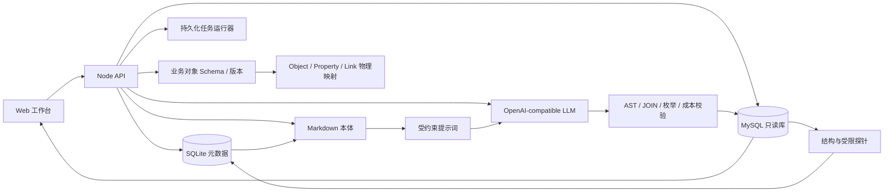

# 架构说明

## 设计取舍

本项目按独立仓库实施，因此没有直接复制 `agent-llm-wiki` 的桌面端代码。边界保持与 V0.2.1 一致：浏览器只负责工作流和展示；数据库连接、探针、知识构建、SQL 校验与执行全部在本地 Node API 中。

## 安全边界

1. 数据源密码以 AES-256-GCM 写入 SQLite；密钥来自 `APP_SECRET`。
2. 敏感字段先按字段名识别，因此这些列不会运行枚举和值域探针；值正则是第二道防线。
3. MySQL 连接关闭多语句；连接测试要求临时建表权限被拒绝。
4. SQL 必须能解析为单条 SELECT；禁止写文件、加锁和危险函数。
5. SQL 中使用的表必须属于 A/B 白名单，JOIN 必须命中已确认关系，枚举字面量必须存在于字典。
6. 隐式关系遵循“结构候选 → LLM 元数据语义判断 → 本地有界值域验证 → 人工确认”；模型建议本身永远不授予 JOIN 执行权限。
6. 追加最大 LIMIT，并在执行前读取 EXPLAIN 预计扫描行数；执行有硬超时。
7. 失败最多自修复两次，之后明确拒答并保留尝试 SQL 与失败原因。
8. Bearer token 映射到角色和数据源范围；限流按身份、来源地址和读/写/查询桶执行。
9. 多轮会话只保存命中表和知识页标识，不保存历史问题、SQL 或结果数据。
10. Held-out Gold SQL 不通过读取接口返回；评测 Gold SQL 也必须先通过只读 AST 护栏。
11. 业务对象 Schema 草稿可以保留校验问题，但发布必须重新匹配最新表、字段与已确认 JOIN；同一数据源同时最多一个发布版本。

## 运行边界

当前实现已覆盖真实数据源、业务对象 Schema 建模与发布基础、本体知识、问数、异步构建、评测和生产部署基础。业务对象 Schema 当前尚未接管 SQL 规划，需完成对象图谱、语义 Query Plan 与评测后再渐进启用。仍需企业侧输入才能完成正式验收：真实 MySQL/LLM 联调、业务口径负责人、30/100+ Gold SQL、企业 SSO/密钥管理、生产负载压测。向量 RRF、行级权限、分布式任务队列和 MCP 输出属于后续扩展，不在本地单实例基线内。
