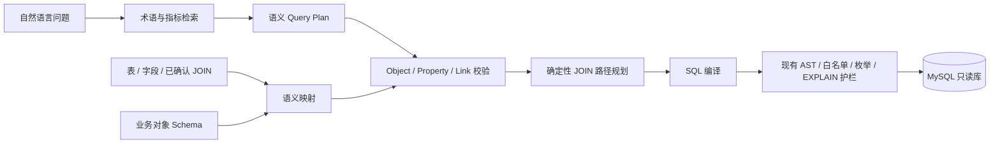

# OntoQuery 本体能力优化计划

> 状态：实施中  
> 基线日期：2026-08-13  
> 目标：在不削弱现有只读查询安全边界的前提下，把平台从“表与知识页驱动的 Text-to-SQL”演进为“业务对象与语义查询计划驱动的问数平台”。

## 1. 背景与现状

当前平台已经具备真实 MySQL 探查、表分级、关系确认、Markdown 知识、受控 Text-to-SQL、SQL AST 护栏、评测和审计能力。现有本体资产主要由以下元素组成：

- 物理层：`table / column / join / enum`；
- 知识层：`term / metric / rule`；
- 展示层：物理表、知识页及其绑定关系构成的图谱。

目前缺少独立于物理表的业务对象层。一个“客户”只能间接通过术语和表表达，无法声明其业务主键、类型化属性、对象间关系、基数以及跨表映射。这会导致：

1. 模型仍需直接从表结构推断业务对象；
2. 同一业务对象分散在多张表时缺少统一入口；
3. 本体页面可以审阅，但尚未成为可机器校验的契约；
4. LLM 直接生成 SQL，业务意图与物理 SQL 之间缺少稳定的中间表示；
5. 多跳 JOIN 路径主要依赖模型选择，尚未形成确定性的图路径规划。

## 2. 目标架构



目标模型分为四层：

1. **物理数据层**：继续由数据库探查产生表、字段、枚举和 JOIN 证据；
2. **业务对象层**：定义 Object Type、Property、Link Type 及其约束；
3. **映射层**：把对象属性映射到物理字段，把对象关系绑定到已确认 JOIN；
4. **查询层**：先生成语义 Query Plan，再确定性编译为 SQL，最后复用现有安全护栏。

## 3. 设计原则

1. **只读边界不变**：本轮不引入数据库写操作或业务 Action；
2. **物理库仍是事实来源**：不复制业务对象实例，只保存 Schema、映射和版本元数据；
3. **草稿允许不完整，发布必须有效**：草稿保存校验结果，发布时针对最新物理 Schema 重新校验；
4. **已确认关系才可发布**：Link Type 的物理映射只能引用人工确认或显式外键关系；
5. **不可变版本**：每次保存产生新版本；发布新版本后，旧发布版本自动转为 `deprecated`；
6. **错误可机器处理**：校验结果提供稳定错误码、字段路径和人类可读说明；
7. **渐进接入查询链路**：先建立建模与发布闭环，经过评测后再影响 SQL 生成；
8. **安全失败**：缺少映射、关系或已发布 Schema 时继续使用当前链路，不静默猜测语义。

## 4. 语义 Schema V1

### 4.1 Object Type

每个业务对象包含：

- `apiName`：稳定的程序标识；
- `displayName`：业务展示名；
- `description`：业务定义；
- `primaryKey`：对象身份属性；
- `properties`：类型化属性及物理映射。

V1 属性类型：`string / integer / number / boolean / date / datetime / enum`。

V1 约束：`minimum / maximum / minLength / maxLength / pattern / enumValues`。

V1 只支持安全、可验证的直接字段映射：

```json
{"table":"crm_customer","column":"customer_id"}
```

派生表达式、跨表计算属性和自定义 SQL 映射推迟到后续阶段，避免把未经验证的 SQL 重新引入建模入口。

### 4.2 Link Type

每个业务关系包含：

- `apiName / displayName / description`；
- `source / target` 对象类型；
- `cardinality`：`one_to_one / one_to_many / many_to_one / many_to_many`；
- `sourceLabel / targetLabel`：双向导航展示名；
- `relationMappings`：绑定一个或多个已确认物理 JOIN。

### 4.3 示例

```json
{
  "name": "billing",
  "displayName": "客户交易本体",
  "description": "客户、订单与支付的统一业务对象模型",
  "objectTypes": [
    {
      "apiName": "customer",
      "displayName": "客户",
      "description": "已注册的业务客户",
      "primaryKey": "customer_id",
      "properties": [
        {
          "apiName": "customer_id",
          "displayName": "客户编号",
          "type": "integer",
          "required": true,
          "mapping": {"table": "crm_customer", "column": "customer_id"}
        }
      ]
    },
    {
      "apiName": "order",
      "displayName": "订单",
      "primaryKey": "order_id",
      "properties": [
        {
          "apiName": "order_id",
          "displayName": "订单编号",
          "type": "integer",
          "required": true,
          "mapping": {"table": "sales_order", "column": "order_id"}
        },
        {
          "apiName": "customer_id",
          "displayName": "客户编号",
          "type": "integer",
          "required": true,
          "mapping": {"table": "sales_order", "column": "customer_id"}
        }
      ]
    }
  ],
  "linkTypes": [
    {
      "apiName": "places_order",
      "displayName": "客户下单",
      "source": "customer",
      "target": "order",
      "cardinality": "one_to_many",
      "sourceLabel": "订单",
      "targetLabel": "客户",
      "relationMappings": [{"relationId": 1}]
    }
  ]
}
```

## 5. 实施阶段

### P0｜计划与契约

状态：**已完成**

- 固化目标架构、V1 Schema 契约和非目标；
- 明确发布校验、版本状态和 API 边界；
- 定义验收与回滚方式。

### P1｜Schema、校验、版本与发布闭环

状态：**已完成基础闭环**

- 实现 Schema 规范化和聚合校验；
- 校验对象、属性、主键、类型、物理字段映射、关系端点与已确认 JOIN；
- 新增不可变 Schema 版本存储；
- 支持保存草稿、独立校验、获取版本、列出历史和发布；
- 发布时基于最新物理元数据重新校验；
- 发布新版本后自动废弃旧版本；
- 保存创建人、发布人、校验摘要与内容校验和；
- 提供 API 和自动化测试。

出口条件：

1. 无效草稿可以保存并返回完整错误列表；
2. 无效版本不可发布；
3. 有效版本发布后可按数据源读取；
4. 同一数据源同时最多一个 `published` 版本；
5. 关系映射无法引用候选、拒绝或已失效 JOIN；
6. 现有问数链路和全部测试保持通过。

### P2｜业务对象图谱与建模工作台

状态：**已完成**

- [x] 图谱增加 Object、Property、Link 与物理映射边；
- [x] 支持“业务语义 / 物理映射 / 全部”视图切换；
- [x] 增加 Schema 版本列表、结构化草稿编辑、校验问题定位和发布操作；
- [x] 按角色限制编辑、校验和发布操作；
- [x] 提供对象、属性、约束、关系与导航标签的结构化表单，JSON 仅作为高级模式；
- [x] 提供物理表、字段和 JOIN 目录选择，不要求人工填写映射标识；
- [x] 增加版本 Diff，并将删除、主键、类型和映射变化标记为破坏性；
- [x] 对失效物理字段、失效 JOIN、候选关系和 C 级表给出可操作提示。

出口条件：业务人员无需编辑 JSON 即可完成对象建模、校验和发布。

P2.1 建立“编辑 Schema → 校验 → 保存不可变草稿 → 发布 → 图谱读取发布版”的垂直链路；P2.2 将编辑入口升级为结构化建模，补齐物理目录选择、失效映射修复与版本差异预览。

### P3｜语义 Query Plan 与路径规划

状态：**已完成基础闭环（默认关闭，待真实评测集门禁后逐步启用）**

- [x] 定义 Query Plan：根对象、维度、指标、过滤、时间粒度、排序和限制；
- [x] 模型只生成 Query Plan，规划提示词不包含物理 mapping、物理 JOIN 或知识页参考 SQL；
- [x] 使用已发布 Link Type 计算合法最短语义路径，并从已确认关系计算物理路径；
- [x] 将 Query Plan 确定性编译为只读 MySQL SQL；
- [x] 继续复用现有 SQL Guard、字段/敏感信息白名单、枚举校验、EXPLAIN 与超时机制；
- [x] 审计记录 Query Plan、Schema 版本、最终语义/物理路径和回退原因；
- [x] 查询证据面板和审计工作台展示规划模式、模型版本与 Object/Link 路径；
- [x] 提供 `off / prefer / required` 功能开关，默认 `off`，保留当前 SQL 规划路径；
- [x] 实现 `off` 基线与 `prefer` 候选的同集对照门禁，持久化等价率、JOIN 失败率、拒答率、上下文表数、规划次数和实际语义执行率；
- [x] 在评测中心展示门禁结论并输出 `enable_prefer / keep_off` 建议；
- [ ] 为本地真实数据源补齐发布版 Ontology Schema 与正式 Gold SQL 评测集，并运行首次真实门禁。

出口条件：选定评测集的结果等价率不下降，且 JOIN 类失败率下降。

### P4｜Schema 演进与评测闭环

状态：**完成**

- [x] 在 P2 基础 Diff 上增加评测依赖影响分类；
- [x] 属性删除、类型、映射和 Link 变化可关联依赖的评测问题、集合与 Gold SQL 物理标识；
- [x] 识别没有评测覆盖的破坏性变更，并且不向读取 API 暴露 Held-out Gold SQL；
- [x] 支持历史发布版按最新物理结构重新校验后回滚，并独立记录发布/回滚事件；
- [x] 发布草稿前自动运行全部受影响评测集，并将通过证据绑定到候选 Schema 版本与评测集内容校验和；
- [x] 服务端拒绝没有当前通过证据、存在覆盖缺口或评测内容已变化的破坏性发布；
- [x] 对失败样本生成对象、属性、关系级修复建议，并持久化到评测运行记录中展示。

出口条件：所有破坏性变更都有影响清单、评测证据和明确确认。

### P5｜受控 Action（可选）

状态：暂缓

- 仅在明确需要 Agent 执行业务动作时启动；
- 必须具备参数校验、权限、审批、幂等、事务或补偿、审计；
- 不与当前只读问数权限复用。

## 6. P1 API 契约

| 方法 | 路径 | 角色 | 用途 |
|---|---|---|---|
| GET | `/api/ontology/schemas?sourceId=:id` | viewer | 列出版本与校验摘要 |
| GET | `/api/ontology/schemas/:id` | viewer | 读取单个版本及完整 Schema |
| GET | `/api/ontology/published?sourceId=:id` | viewer | 读取当前发布版本 |
| POST | `/api/ontology/validate` | editor | 只校验，不持久化 |
| POST | `/api/ontology/schemas` | editor | 保存不可变草稿版本 |
| POST | `/api/ontology/schemas/:id/publish` | editor | 重新校验并发布 |

发布接口在校验失败时返回 `422`，响应包含：

```json
{
  "ok": false,
  "errors": [
    {
      "code": "ONTOLOGY_MAPPING_COLUMN_NOT_FOUND",
      "path": "objectTypes[0].properties[1].mapping.column",
      "message": "映射字段 crm_customer.missing 不存在"
    }
  ],
  "warnings": []
}
```

## 7. 存储与索引

新增 `ds_ontology_schema_version`：

- 版本内容使用 JSON 保存；
- `UNIQUE(source_id, version)` 保证数据源内版本唯一；
- 索引 `(source_id, version DESC)` 支持版本历史查询，发布版本使用 `status='published'` 的唯一部分索引；
- 校验结果随版本保存，发布时更新为最新结果；
- 不修改或删除历史版本内容。

## 8. 测试策略

P1 自动化覆盖：

1. 合法 Schema 规范化与类型映射；
2. 重名、非法名称、主键错误和未知属性类型；
3. 物理表、字段不存在或不可用；
4. 语义类型与数据库类型不兼容；
5. Link 端点、基数和已确认 JOIN 校验；
6. 多错误聚合及稳定错误码；
7. 无效草稿保存、发布拒绝；
8. 有效版本发布和旧版本自动废弃；
9. API 权限、数据源隔离和 `422` 响应；
10. 现有 46 项后端测试、构建、Lint 和渲染测试回归；
11. 发布版对象节点、语义关系、对象到表映射以及知识到对象绑定。

P3 自动化新增覆盖：Query Plan 属性/操作符/枚举校验、确定性 JOIN 路径、敏感字段拒绝、行数上限、最终 SQL Guard，以及规划提示词不泄露物理 mapping。生产启用前仍需在正式真实数据源评测集建立结果等价率、JOIN 失败率、拒答率、平均上下文表数和模型修复次数基线。

## 9. 风险与回滚

- P1 新表和新 API 不参与现有查询编排，失败不会影响当前问数；
- 未发布或无效 Schema 永远不进入查询上下文；
- Query Plan 使用 `off / prefer / required` 功能开关；默认 `off`，`prefer` 仅在结构上下文足够时安全回退当前 SQL 规划路径；
- 发布回滚通过重新发布历史有效版本实现，不删除任何版本；
- 物理 Schema 变化后，发布与查询前必须重新检查映射有效性。

## 10. 本轮非目标

- 不保存客户、订单等业务对象实例；
- 不实现业务数据库写入和 Action；
- 不支持任意 SQL 属性映射；
- 不引入图数据库；
- 不替换 SQLite、MySQL 连接器或现有 SQL Guard；
- 不在缺少正式评测集时直接切换查询主链路。

## 11. 实施记录

| 日期 | 阶段 | 记录 |
|---|---|---|
| 2026-08-13 | P0 | 完成优化计划、Schema V1、API 和验收标准设计 |
| 2026-08-13 | P1 | 完成 Schema 校验、版本存储、发布切换、角色权限、API、演示本体与自动化测试；查询主链路保持不变 |
| 2026-08-13 | P2.1 | 完成业务对象建模工作台、版本选择、JSON 编辑、问题定位、发布操作，以及业务对象/物理映射双视图图谱；查询主链路仍保持不变 |
| 2026-08-13 | P2.2 | 完成无代码结构化建模、物理目录选择、失效映射修复提示、JSON 高级模式和基础版本 Diff；P2 出口条件达成 |
| 2026-08-13 | P3.1 | 完成语义 Query Plan 契约、校验、最短 Object/Link 路径、已确认物理关系解析、确定性 SQL 编译、功能开关、审计与查询证据展示；默认关闭，等待真实评测集门禁后启用 |
| 2026-08-13 | P3.2 | 完成 `off / prefer` 同集对照评测、门禁指标持久化、启用判定和评测中心展示；本地真实源尚缺发布版 Schema 与 Gold SQL 用例，暂不切换默认模式 |
| 2026-08-13 | P4.1 | 完成破坏性变更到评测用例的依赖影响清单、未覆盖变更提示、历史版本重新校验回滚和发布事件留痕；候选版本自动评测仍待实施 |
| 2026-08-13 | P4.2 | 完成候选草稿的语义查询执行、受影响评测集自动门禁、候选版本与评测内容校验和绑定，以及服务端破坏性发布拦截；评测内容变化后旧证据自动失效 |
| 2026-08-13 | P4.3 | 完成失败样本的语义修复定位：根据 Query Plan、Object/Link 路径或问题语义定位对象、属性和关系，生成不暴露物理映射的修复提示并持久化展示 |
