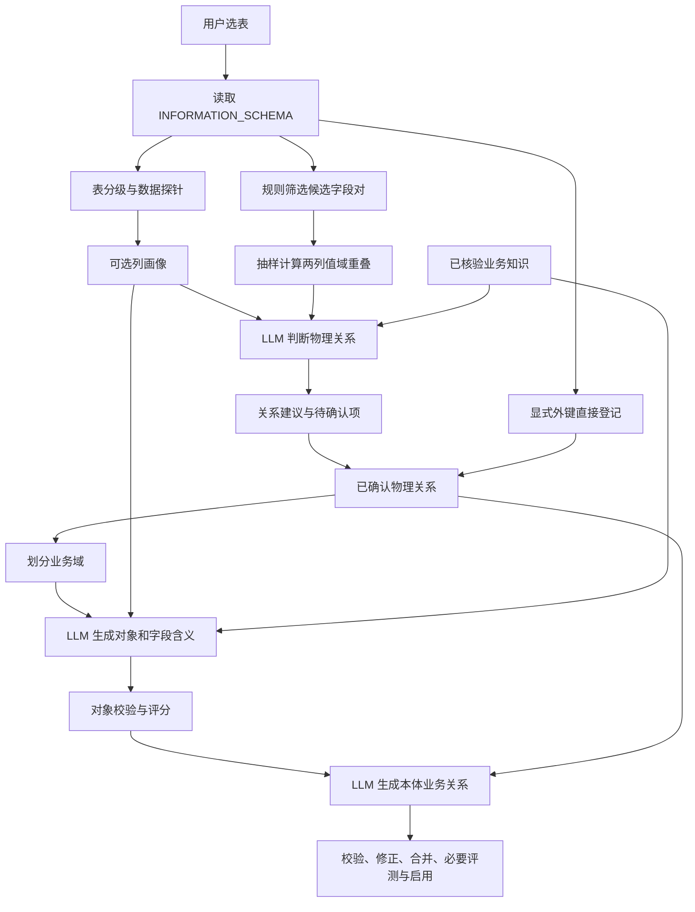

# 数据源构建本体：代码调用链与关系识别效果评估

> 本文保留修复前的评估基线。2026-09-07 已按[修复方案与实施记录](SOURCE_ONTOLOGY_RELATION_REPAIR_PLAN.md)完成本地修复及回归；下文问题描述和代码行号用于追溯原始判断，当前实现与能力边界以实施记录为准。

评估日期：2026-09-07。本版替换上一版评估，以当前源代码、实际 Prompt 构造、现有测试和隔离数据流复现为依据。没有连接生产数据库或调用真实模型；文中默认参数不代表生产当前设置。

## 评估结论

当前确实实现了“读取表结构和抽样数据证据，由 LLM 识别关系”。这条技术路线合理，具备结构、数据值和业务知识相互补充的基础，能够辅助识别规范数据库中的业务关联。

更准确地说，识别方式是：**规则先筛选候选字段对 → 抽样形成证据 → LLM 判断字段对是否存在业务关系**。LLM 不能自行增加候选，也不能主动查询数据库补证据。当前主要瓶颈在候选覆盖、采样代表性、模型输出完整性和关系证据在后续阶段的衔接。

因此，当前可以定位为“有数据证据支持的关系辅助识别与本体生成”，尚不足以证明能稳定自动构建完整、准确的业务本体。这里的判断来自实现边界，不是给真实模型准确率打分。

## 1. 真实调用链

统一入口是 `POST /api/sources/:id/ontology-build`，它创建持久化任务，调用 `sourceOntologyBuild.run`；后者先执行 discovery，再编排本体生成。服务装配见 [server.mjs:49](../server/src/server.mjs#L49)、[server.mjs:76](../server/src/server.mjs#L76)，源构建探查入口见 [source-ontology-build-service.mjs:135](../server/src/source-ontology-build-service.mjs#L135)。



这不是单次模型调用完成所有工作。关系识别、对象生成、本体关系生成分别有不同的输入与权限；业务域命名和语义 critic 还可能有辅助模型调用。

| 阶段 | 实际逻辑 | 模型作用 |
| --- | --- | --- |
| 读取结构 | 读取表、列、索引标记和外键；限制在用户选表范围内 | 无 |
| 数据探针 | 非 C 表进行常规列探针；可选列画像 | 无，SQL 和统计由程序执行 |
| 候选召回 | 按字段后缀、目标键/索引、命名/注释和类型筛选字段对 | 无，规则先确定候选 |
| 物理关系识别 | 抽取候选两列值域；附结构、画像与知识交给模型 | 判断是否有关联、基数、置信度、理由 |
| 对象生成 | 分批提供表字段、画像、枚举、已确认关系和业务知识 | 生成业务对象、属性名称、说明和术语绑定 |
| 本体关系生成 | 提供同一批次已确认对象与已确认 relationId | 生成关系业务含义、名称、方向、反向名称和类型 |
| 合并启用 | 服务端校验映射、评分、处理问题和版本变化 | 部分不确定定义可再次调用模型修正 |

依据：[discovery-service.mjs:16](../server/src/discovery-service.mjs#L16)、[ontology-candidate-generator.mjs:116](../server/src/ontology-candidate-generator.mjs#L116)、[ontology-candidate-generator.mjs:223](../server/src/ontology-candidate-generator.mjs#L223)。

## 2. “抽取表数据”具体做了什么

采样分三条路径，不能用一个开关概括全部取数行为：

| 路径 | 数据如何抽取 | 进入模型的形式 |
| --- | --- | --- |
| 常规枚举探针 | 对 tinyint、enum、bool、char/varchar 等类型列，默认从最多 10000 个非空值中聚合；满足字典条件才登记枚举 | 对象生成能看到已登记枚举；第一轮关系 Prompt 没有独立枚举清单 |
| 列画像，需开启 profiling | 默认每次最多 20 张表，每表最多 1000 行；优先按主键倒序，否则合适时间列倒序 | 每列最多 5 个高频样例、格式、样本去重数和空值比例 |
| 候选关系重叠 | 候选两列各自按值排序、DISTINCT，默认各取前 500 个非空值 | 左样本出现在右样本中的比例 overlapRatio |

依据：[db-probe.mjs:29](../server/src/db-probe.mjs#L29)、[db-probe.mjs:81](../server/src/db-probe.mjs#L81)、[column-profile.mjs:33](../server/src/column-profile.mjs#L33)、[discovery-service.mjs:222](../server/src/discovery-service.mjs#L222)。

画像关闭仍会进行常规枚举探针和符合条件的关系重叠采样。仓库默认画像关闭，实际运行以环境与已保存设置为准。依据：[config.mjs:87](../server/src/config.mjs#L87)、[settings-service.mjs:30](../server/src/settings-service.mjs#L30)、[discovery-service.mjs:95](../server/src/discovery-service.mjs#L95)。

当前画像保留样本值并截断展示，不应把 Prompt 中遗留的“脱敏列画像”措辞当作数据实际已脱敏的证据。本评估使用“列画像”表述。依据：[column-profile.mjs:43](../server/src/column-profile.mjs#L43)、[column-profile.test.mjs:10](../server/test/column-profile.test.mjs#L10)。

## 3. 每轮 LLM 到底能看到什么、决定什么

### 第一轮：识别物理关系

每个候选有两端表名、表注释、列名、列注释、类型；源列索引标记；目标列主键、唯一和索引标记；结构分和理由；overlapRatio；以及可选画像。另提供与候选表相关、verified 的知识，每批最多 5 页，每页最多 300 字。

模型返回 `relation / uncertain / none`、confidence、cardinality 和 reason。只能使用已有 candidateId，不能提出新字段对。

模型看不到候选表的全部其他字段，也看不到样本完整行、跨列配对、画像采样数量/时间/方法、数值范围。比如订单中的 customer_id 和 tenant_id 是否需要共同决定目标客户，不能通过当前仅有的 customer_id 字段对输入充分判断。这里说的是第一轮关系 Prompt；后续对象 Prompt 能看到更多表字段，但不能补造物理 JOIN。

依据：[relation-model-service.mjs:55](../server/src/relation-model-service.mjs#L55)。

### 第二轮：生成业务对象

这一步给模型更多表级上下文：按字段预算截取的表结构、注释、列画像、枚举含义、已确认关系、知识与术语。当前候选契约是一表一个对象、单表映射，默认每批字段预算 600；超宽表会截断并记录不完整证据。

模型命名和描述对象及字段；类型、必填性和物理映射由服务端规范化。它不会在这一步输出任意可执行 JOIN。

依据：[ontology-candidate-generator.mjs:72](../server/src/ontology-candidate-generator.mjs#L72)、[ontology-candidate-generator.mjs:116](../server/src/ontology-candidate-generator.mjs#L116)、[ontology-candidate-generator.mjs:148](../server/src/ontology-candidate-generator.mjs#L148)。

### 第三轮：生成本体业务关系

输入是已确认对象的业务名称、说明、属性信息，以及已确认物理关系的 relationId、等式和基数。这里不再附原始列画像或重叠率，模型主要依靠对象语义、已确认关系及知识生成 Link 的名称、用途与方向。relationMappings 和基数由服务端基于既有物理关系确定。

因此，第一轮没有发现或尚未确认的物理关系，不能由这轮自动补出来；不能把“对象看过完整字段”理解为“关系模型已自由检查所有字段组合”。

依据：[ontology-candidate-generator.mjs:204](../server/src/ontology-candidate-generator.mjs#L204)、[ontology-candidate-generator.mjs:223](../server/src/ontology-candidate-generator.mjs#L223)、[ontology-candidate-generator.mjs:253](../server/src/ontology-candidate-generator.mjs#L253)。

## 4. 识别效果的主要优点

- **结构、值域和业务知识都实际进入识别链路。** 重叠采样在模型之前执行，有助于模型区分仅命名相似和有数据支持的关联；Prompt 也明确提醒通用 id 相等不代表业务关系。
- **成本和范围有约束。** 默认最多 600 个物理候选、每源列最多 4 个目标，候选按表分配，避免少数表耗尽额度；模型请求支持超时拆批。
- **物理事实由程序维护。** 模型不能新增候选 ID 或凭空写物理映射，便于把语义生成与可执行关系分开验证。
- **后续对象生成有较丰富的上下文。** 已登记的枚举、知识、术语与旧对象说明有机会补足字段注释不足，而不只是翻译列名。

依据：[relation-candidates.mjs:12](../server/src/relation-candidates.mjs#L12)、[relation-model-service.mjs:29](../server/src/relation-model-service.mjs#L29)、[ontology-candidate-generator.mjs:116](../server/src/ontology-candidate-generator.mjs#L116)。

## 5. 直接影响关系识别效果的问题

### 5.1 候选规则决定召回上限，模型无法补回被筛掉的关系

源列必须有 id/no/code/key/uuid 后缀且不是主键；目标列必须符合键/索引条件；还要通过命名或注释相似及类型兼容检查。规则随后截取每列 4 个目标和全源 600 个候选。

即使数据完全匹配，customer、buyer、uid 之类命名、无索引业务键、共享主键一对一、角色别名或类型不同的关联也可能在采样前被排除。候选层还保留字段名排除规则，与探针允许采样所有列的当前行为并不一致，例如 account_no 会被过滤。

本轮用相同合成表结构复现：规范 customer_id 得到 1 个候选；仅改名为 customer、去掉目标索引，或把源列设为主键，均得到 0 个候选。它说明条件边界，不是整体召回率估计。

依据：[relation-candidates.mjs:16](../server/src/relation-candidates.mjs#L16)、[relation-candidates.mjs:54](../server/src/relation-candidates.mjs#L54)、[sensitive-fields.mjs:7](../server/src/sensitive-fields.mjs#L7)。

### 5.2 有采样，但目前证据不足以充分验证业务关联

overlap 比较的是两侧排序前缀，不是“左样本在完整目标表中的存在率”。若左样本为 501..1000，右表真实值域为 1..1000，右侧只抽到 1..500，则现有函数结果为 0，真实包含率却可为 100%。独立表的低值自增 ID 也可能形成高交集。

列画像倾向主键高值段，overlap 倾向字段低值段；每列只保留最多 5 个样例，也失去了同一记录中多列的组合关系。按目录顺序默认只画像最多 20 张表，没有按未确定关系自动补采样。LLM 看不到这些取样范围与数量，无法充分校正证据偏差。

当前没有专门的数据验证步骤计算匹配行放大倍数、目标唯一性、孤儿率、联合键匹配或按租户/时间分层的稳定性。模型返回明确 cardinality 时，代码优先采用其判断；因此“提供了真实样本”不能直接等于“关系基数经过数据验证”。

依据：[db-probe.mjs:81](../server/src/db-probe.mjs#L81)、[discovery-service.mjs:59](../server/src/discovery-service.mjs#L59)、[discovery-service.mjs:222](../server/src/discovery-service.mjs#L222)、[discovery-service.mjs:236](../server/src/discovery-service.mjs#L236)。

### 5.3 模型漏答会成为负向关系结果

输出规范化对缺失的 candidateId 默认填 `uncertain`、confidence=0；批次完成状态按补齐后的条数计算，因此模型返回合法 JSON `{}` 也会显示 completed、judgedCount 全覆盖。发现层随后把这些结果存为 rejected。

本轮真实 discovery + model service + store 数据流复现了这一点：1 个有效候选、overlap=1、模型响应 `{}`，最终 relationStatus=rejected、modelDecision=uncertain、modelConfidence=0、analysisStatus=completed、judgedCount=1。

这是模型输出质量处理上的明确缺陷：未完成判断应与有依据否定关系分别记录。对已有 review 记录也可能造成降为 rejected；已 confirmed/denied 状态有另外的保护。

依据：[relation-model-service.mjs:24](../server/src/relation-model-service.mjs#L24)、[relation-model-service.mjs:78](../server/src/relation-model-service.mjs#L78)、[discovery-service.mjs:109](../server/src/discovery-service.mjs#L109)、[store.mjs:394](../server/src/store.mjs#L394)。

### 5.4 画像刷新失败后可能继续向模型提供旧值

画像非空时才 upsert，取样失败或超出本次额度不会使已有画像失效；随后从 store 读取画像附进模型。存储有 sampledAt 和 sampleSize，但关系 Prompt 丢弃这两个字段。

本轮先成功画像、再模拟画像 SQL 失败，实际第二次模型请求仍含第一次样本；采样时间没有更新，Prompt 中也没有过期或失败说明。这允许新 overlap 与旧画像混用。

依据：[discovery-service.mjs:76](../server/src/discovery-service.mjs#L76)、[discovery-service.mjs:96](../server/src/discovery-service.mjs#L96)、[store.mjs:378](../server/src/store.mjs#L378)、[relation-model-service.mjs:72](../server/src/relation-model-service.mjs#L72)。

### 5.5 模型置信度、综合分和 85 分是不同的规则

第一轮物理关系判断默认按以下条件生成建议：

- decision=relation 且模型 confidence≥0.55；
- 或 decision=uncertain 且 confidence≥0.70；
- 其他结果进入 rejected；新建议进入 review。

另外保存的综合 confidence = 模型置信度×0.60 + 结构分×0.25 + overlap×0.15，它没有用于上述建议门槛。overlap 缺失时在该综合分里按 0 处理，但不单独阻止产生建议。

后续 Object/Link 的 85 分是另一套规则评分：物理映射 35、文本语义相似 25、结构证据 25、知识 10、模板 5。前 3 项即可达到 85；它不是第一轮关系阈值，也不是业务正确概率。

这并不否定评分的路由价值，但产品若要说明“可信到什么程度”，应依据独立标注和数据验证结果。依据：[discovery-service.mjs:109](../server/src/discovery-service.mjs#L109)、[ontology-candidate-score.mjs:6](../server/src/ontology-candidate-score.mjs#L6)、[ontology-candidate-score.mjs:99](../server/src/ontology-candidate-score.mjs#L99)。

### 5.6 联合约束的物理表示不足

索引查询把联合唯一索引的各成员标为 isUnique；外键没有保留约束名、列序和完整列组，随后逐列保存为 confirmed 关系。复合唯一条件不能证明单列唯一，复合外键也不能用各列独立等式替代完整 JOIN。

这会污染提供给模型的结构证据，后续校验和评分也可能信任同一份错误的单列唯一标记。需从元数据表示修正，不能仅靠提示词弥补。本项为静态代码证据，未测量真实库影响范围。

依据：[db-introspect.mjs:4](../server/src/db-introspect.mjs#L4)、[discovery-service.mjs:83](../server/src/discovery-service.mjs#L83)、[semantic-schema.mjs:217](../server/src/semantic-schema.mjs#L217)。

## 6. 识别后转成本体时的限制

这部分影响最终本体完整性，与第一轮 LLM 是否参与识别分开评估：

1. **物理关系确认尚未完全纳入统一构建待办。** 模型识别出的新关联先为 review；只有已确认关系能进入 Link。不能据此说“没有用 LLM 识别”，但它确实影响识别结果何时进入最终本体。
2. **本体关系端点限于当前 run。** 域拆分后的跨批边没有全局补边阶段；相同对象 ID 的自引用在 Link scope 中被跳过。首次评估中已用函数复现 21 表/20 边拆批剩 19 边、已确认自引用仍为 0 Link。
3. **自动修正不会主动获取新数据库证据。** refineRun 根据已有目录、知识、低分候选和缺失表重新生成；没有根据模型的不确定点调用新的数据探针。额外事实主要来自用户补充知识或另行探查。
4. **完成条件主要覆盖对象，缺少关系召回验收。** 有对象缺表检测，但没有把应覆盖的每条物理关系与最终 Link 一一对账；首次发布没有既有版本时也不触发差异评测。因此对象数量、ready 状态和发布成功不能代表全部关系已经验证。

依据：[source-ontology-build-service.mjs:220](../server/src/source-ontology-build-service.mjs#L220)、[ontology-domain-modeling-service.mjs:28](../server/src/ontology-domain-modeling-service.mjs#L28)、[ontology-candidate-service.mjs:177](../server/src/ontology-candidate-service.mjs#L177)、[ontology-candidate-generator.mjs:204](../server/src/ontology-candidate-generator.mjs#L204)、[ontology-candidate-service.mjs:325](../server/src/ontology-candidate-service.mjs#L325)、[ontology-candidate-service.mjs:409](../server/src/ontology-candidate-service.mjs#L409)、[semantic-schema-service.mjs:42](../server/src/semantic-schema-service.mjs#L42)。

## 7. 本轮验证记录

本轮运行 12 个相关测试文件，**110/110 通过，0 失败、0 跳过**：

```sh
node --test \
  server/test/relation-model.test.mjs \
  server/test/column-profile.test.mjs \
  server/test/db-probe.test.mjs \
  server/test/source-ontology-build.test.mjs \
  server/test/ontology-domain-modeling-service.test.mjs \
  server/test/ontology-domain-plan.test.mjs \
  server/test/ontology-candidate-generator.test.mjs \
  server/test/ontology-candidate-service.test.mjs \
  server/test/ontology-candidate-score.test.mjs \
  server/test/ontology-candidate-critic.test.mjs \
  server/test/ontology-draft-assembler.test.mjs \
  server/test/semantic-schema.test.mjs
```

另使用真实 discovery、候选生成、画像计算、Prompt 构造、模型响应解析和 SQLite 持久化，以合成表数据与模拟模型 HTTP 响应串联验证：

| 场景 | 实际结果 |
| --- | --- |
| 画像关闭 | 仍执行 2 次 overlap SQL；模型得到 overlap=1，profile=null |
| 画像开启 | 两侧样本值与统计进入模型；其他字段 tenant_id、完整行和样本时间数量未进入该关系候选 |
| 模型漏答 | relation 被记为 rejected，分析状态仍 completed |
| 首次画像成功，第二次画像失败 | 第二次模型请求沿用旧画像 |
| 改动候选条件 | 规范字段可召回；无后缀、无目标索引、源列为主键的变体被排除 |
| 左右采样范围错位 | 实际关系可完全包含，但前缀样本 overlap=0 |

脚本：`/tmp/source-ontology-second-pass-probe.mjs`；结果：`/tmp/source-ontology-second-pass-probe-results.json`；回归日志：`/tmp/source-ontology-second-pass-tests.log`。脚本会创建并清理隔离临时数据库，不修改项目业务数据。

这些验证证明数据流和边界行为，**不能证明真实 LLM 的准确率、召回率、耗时或成本**。现有源构建测试替换了部分模型、规划器和相似度；仓库最近部署记录也明确没有真实模型重建回放。依据：[source-ontology-build.test.mjs:16](../server/test/source-ontology-build.test.mjs#L16)、[ONTOLOGY_SIMPLIFIED_EXPERIENCE_PROPOSAL.md:178](ONTOLOGY_SIMPLIFIED_EXPERIENCE_PROPOSAL.md#L178)。

## 8. 适用范围和改进顺序

| 数据场景 | 当前工程判断 |
| --- | --- |
| 规范命名、注释清楚、单列业务键、有索引的小业务域 | 已具备较好的辅助识别基础，值得用真实标注集验证 |
| 没有外键但字段含义清楚、存在索引和知识依据 | LLM 能识别候选，不依赖必须有外键；最终本体仍取决于确认与补边 |
| 字段别名多、缺索引、共享主键、业务角色复杂 | 前置规则容易漏掉，换模型不能直接恢复这些关系 |
| 历史跨度大、分租户、样本分布不一致 | 当前数据证据较弱，错误重叠和遗漏组合条件的风险更高 |
| 跨域、组织树、联合键、多跳业务关系 | 同时受识别证据与后续本体生成边界限制，需要专项改进 |

建议分三步：

1. **先修确定的结果失真。** 模型漏答单独记录并重试；画像携带采样时间、数量、范围与失败状态；保留联合键完整约束；区分“无关系”“证据不足”“未判断”。
2. **再提高证据和召回。** overlap 改为从有界源样本查询完整目标表的实际匹配，再统计唯一性与放大倍数；按租户、时间、非空/异常等情形取代表样本。增加语义别名与模型提议候选渠道，所有新增候选仍经程序校验与数据验证。按证据缺口补样，而不是反复使用同一份摘要。
3. **最后完善本体完整性和效果评测。** 生成后全局补跨域/自引用边；把物理识别与本体 Link 覆盖分别统计。对真实标注关系报告准确率、召回率、方向/基数正确率、人工修订率，再用代表性跨表问法检验 Gold SQL 结果等价。

总体上值得继续沿用这条路线；现阶段最有收益的工作是让 LLM 看到更完整、可解释的证据，并避免流程把“没看到、没判断、没生成”当作“没有关系”。仅调模型或调 85 分阈值，收益会受到这些边界限制。

本次只重写评估文档，没有修改业务实现或创建 Git commit。
